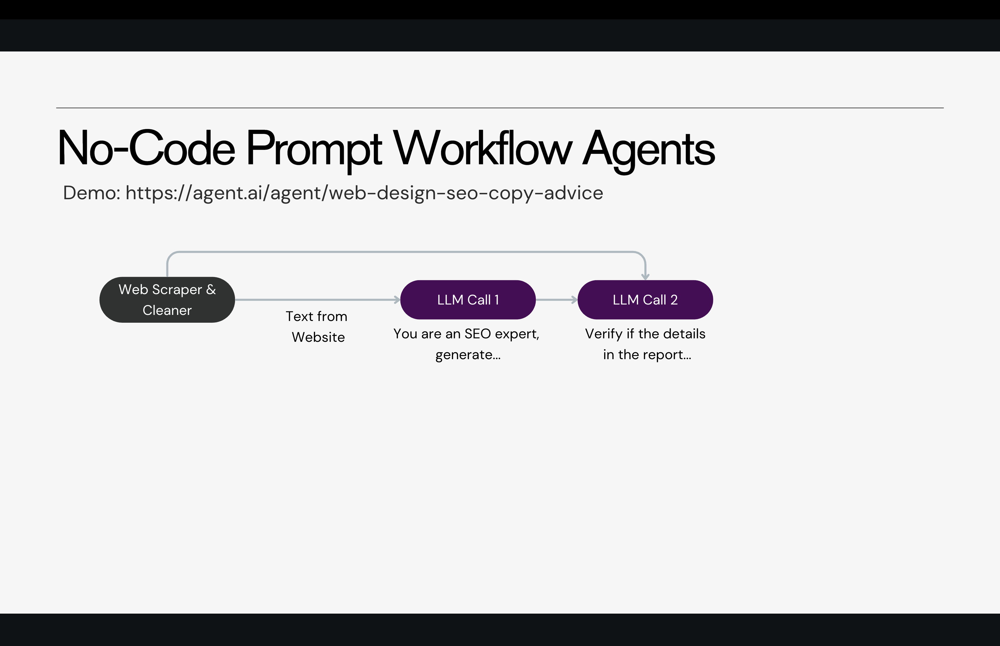
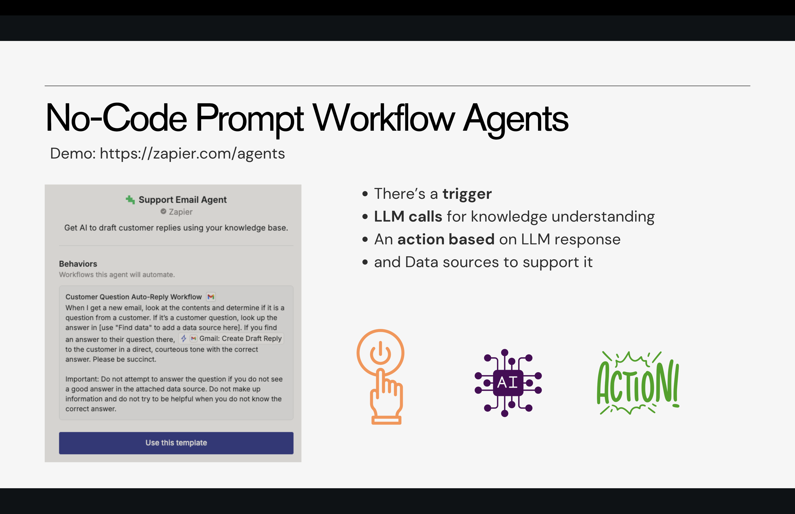
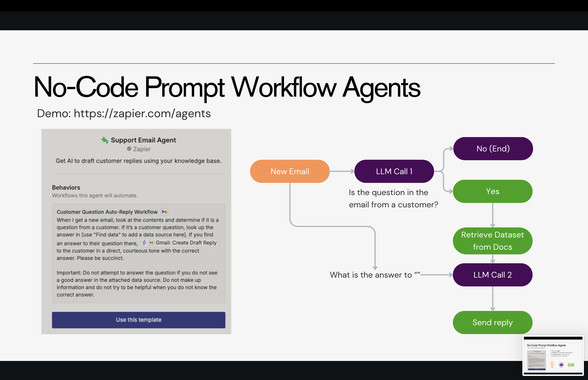

1. [Prompt Engineering in 2025](https://www.canva.com/design/DAG1bSuM4kU/fbzl0OT2_JlejNQK03esKQ/view?utm_content=DAG1bSuM4kU&utm_campaign=designshare&utm_medium=link2&utm_source=uniquelinks&utlId=he485ec526d)

2. [Building Workflow Agents For The Enterprise](https://www.canva.com/design/DAG1bf6YNpE/lAMZmuk6IxQux5mFe7c9ww/view?utm_content=DAG1bf6YNpE&utm_campaign=designshare&utm_medium=link2&utm_source=uniquelinks&utlId=h4ca12cd598)

### **What is Prompt Engineering?**

---

### **Levels of Prompt Engineering**

- Advanced Methods
- Automatic Optimization  
- Reasoning Models

---

### **Building Workflow Agents**

- Zapier Agents
- Hubspot Agents

---

### **Prompt Engineering**

The art/science of communicating with AI models

---

### **Why Prompt Engineering**

**Statistical Nature vs. True Understanding:**
LLMs learn from data patterns, not real experience, so precise prompts guide them to the right output.

**Ambiguity and Context:**
Humans infer meaning naturally, but LLMs need explicit instructions to avoid misinterpretation.

**Predictability and Control:**
For enterprise use, prompt engineering fine-tunes responses to meet strict performance and cost targets.

**Complex Task Breakdown:**
Engineered prompts break complex tasks into clear, logical steps, mimicking human reasoning.

---

**Prompt Engineering ©**

**Skill Based Prompting   2023 and Early 2024**
Users need to acquire prompt engineering techniques like **Chain of Thought** and **ReAct** to guide the model effectively.

**Automated Prompt Optimization   Late 2024**
Application or Model developers add an optimization layer that refines and enhances prompts before they reach the model.

**Self-Optimizing Models   >2025**
The model automatically recognizes the nature of the query (e.g., reasoning tasks) and selects the best prompting strategy internally, without user intervention.

Prompt Engineering Skills as AI end users ∞ 1
AI Capabilities
The smarter AI becomes, the less prompt engineering users need to do.
---

**Prompt Engineering ©**

**Skill Based Prompting**
Level 1: In Context Learning
Level 2: Advanced Methods

**Automated Prompt Optimization**
Level 3: Meta Prompting/Prompting Engines
Level 4: Algorithmic Optimization

**Self-Optimizing Models**
Level 0: Models are prompt optimized

---

**Prompt Engineering in the Enterprise**

LLMs and prompt engineering provide the most straightforward approach to building AI applications.
Why?

* **Latency:** You only incur the latency of the LLM itself, and in most cases, you can precisely estimate it—especially time to first token.
* **Cost:** No additional components are required, making costs predictable since they scale with the number of tokens.
* **Skill/Effort:** Prompt engineering is becoming increasingly automatable, reducing the expertise barrier.
* **Performance:** The only real reason to consider a different approach is if prompt-based methods don’t meet your performance needs.

---
**Skill-Based Prompting: Level 1**

* **In-Context Learning:** Teaching LLMs through Prompts (vs. Traditional Training)
* **Simple Rules:**
  ○ **Zero-Shot:** Ask LLM to answer without examples
  ○ **Few-Shot:** Including examples in your prompt reliably guides the model.
  ○ **Role-Based Prompts:** Define a role (e.g., “You are a…”) to set context.
  ○ **Keep It Simple:** Use clear, straightforward English.
  ○ **Comprehensive Explanation:** Share all relevant information to reduce ambiguity.
  ○ **Avoid Bias:** Avoid sycophancy.
  ○ **Natural Tone:** Instruct the model to respond as it would in everyday conversation.

**Implementation Detail**

* **System/Developer prompt:** Hidden instructions that set the context, tone, and rules for the AI's behavior.
* **User prompt:** The query or message you type that the AI responds to.

This is useful for API wrappers.

**For example, in a banking support system you can add a system prompt like "Answer banking questions only, be friendly"—ensuring the LLM sees both the system and user prompts each time.**

---

# ✅ **What is Skill-Based Prompting: Level 2?**

Level 2 Prompt Engineering goes *beyond simple prompting* (zero-shot, few-shot, role prompts).
It introduces structured methods that **improve the reasoning ability** of LLMs by:

✔ guiding the model to think
✔ calling the model multiple times
✔ verifying or breaking down problems
✔ combining answers from multiple reasoning paths

These techniques appear in 70+ research papers and fall into **three major categories**:

---

# **1️⃣ Thought Generation & Reflection**

*(Chain-of-Thought, Chain-of-Verification)*

## ⭐ What It Means

You tell the LLM to **think step-by-step**, produce intermediate reasoning, or reflect on its own answer.

### Two major techniques:

---

## **A. Chain-of-Thought (CoT)**

You add instructions like:

> "Let's think step by step."

This improves reasoning on math, logic, troubleshooting, and structured tasks.

### Example from your slides:

* **Few-shot CoT** → Model sees examples of step-by-step thinking
* **Zero-shot CoT** → You simply instruct it
* Produces far more accurate answers

---

## **B. Chain-of-Verification (CoVe)**

A multi-step process:

1. Model gives an initial answer
2. Model generates questions to verify the answer
3. Model answers verification questions
4. Final corrected answer is produced

### Why it matters

✔ Reduces hallucinations
✔ Ensures answers are grounded in facts
✔ Useful in enterprise systems like compliance, finance, healthcare

---

# **2️⃣ Decomposition**

*(Breaking a complex task into smaller tasks)*

## ⭐ What It Means

Instead of asking one big question, the LLM is guided to:

1. **Understand the problem**
2. **Create a plan**
3. **Execute the plan** step-by-step

### Example from your slide

The dance-class problem is solved correctly only when the model:

* Breaks the problem into subtasks
* Calculates each part
* Produces a final answer

Without decomposition, the model gives wrong answers.

---

## Why Decomposition Works

✔ LLMs handle **short, well-scoped tasks** better
✔ Reduces compounding reasoning errors
✔ Gives predictable, auditable steps (important in enterprise AI)

---

# **3️⃣ Ensembling**

*(Self-Consistency Prompting)*

## ⭐ What It Means

Instead of trusting **one answer**, the model:

1. Generates **multiple reasoning paths**
2. Produces many answers
3. Aggregates them (majority vote or averaging)

### Why Ensembling Helps

LLMs often make mistakes in reasoning, but:

> Multiple reasoning paths converge to the correct answer.

### Example from your slide

Model generates answers: $14, $18, $26, $18
Final ensemble answer = **$18** (correct)

---

# 🎯 **How Level 2 Prompting Improves AI Performance**

| Technique                 | Strength                           |
| ------------------------- | ---------------------------------- |
| **Chain-of-Thought**      | Better reasoning accuracy          |
| **Chain-of-Verification** | Reduces hallucinations             |
| **Decomposition**         | Handles complex tasks reliably     |
| **Ensembling**            | Improves consistency & correctness |

---

# 📌 **When to Use Level 2 Prompting?**

Use it when:

✔ The problem requires **reasoning**, not just retrieval
✔ You need **higher accuracy or reliability**
✔ Tasks are too complex for a single prompt
✔ You can afford higher cost/latency (multiple model calls)

---

# 🚀 **Enterprise Impact**

These methods are essential for:

* Healthcare reasoning
* Financial compliance
* Fraud detection
* Customer support workflows
* Autonomous agents
* Troubleshooting systems

They allow AI to act more like a human analyst than just a text generator.

---

### **Meta-Prompting: Level 3**

○ Instead of requiring humans to learn and apply optimization techniques, what if you could integrate these techniques directly into a **model** and train it to generate useful prompts automatically?

* Meta prompts are specifically designed to help the model generate prompts by leveraging best practices in prompt generation.
* For example:
  ○ Anthropic Meta Prompting (Click **here**)[https://platform.claude.com/docs/en/build-with-claude/prompt-engineering/prompt-generator]
  ○ OpenAI Meta Prompting (Click **here**)[https://platform.openai.com/chat/edit?models=gpt-4.1]

---

# ✅ **What Is Algorithmic Optimization (Level 4)?**

Level 4 is the stage **beyond prompt engineering**.
Instead of manually crafting better prompts (Levels 1–3), Level 4 uses **algorithms to automatically optimize prompts and model behavior**.

This is where **DSPy** comes in.

---

# 🧩 **What is DSPy?**

DSPy is a framework created by Stanford that allows developers to **program** large language models instead of manually prompting them.

Their slogan says it clearly:

> **"Programming—not prompting—Foundation Models."**

DSPy replaces human-written prompts with:

* **Algorithms**
* **Learned prompt templates**
* **Optimized instructions**
* **Automatic tuning**

It treats prompts as *parameters that can be optimized* the same way machine learning models tune weights.

---

# 🔍 **Why DSPy Exists**

Manual prompt engineering has limits:

❌ prompts are brittle
❌ prompts don’t scale
❌ humans can’t find the best prompt reliably
❌ complex workflows need many interdependent steps

DSPy solves this by letting **algorithms** do the optimization.

---

# 🚀 **How DSPy Works (Simplified)**

1. **You define a task**
   Example: “Answer customer support questions correctly.”

2. **You define modules**
   (e.g., retrieval, reasoning, summarization)

3. **You give DSPy some training examples**

4. **DSPy automatically tunes prompts and model parameters**
   It tries many variations of:

   * instructions
   * reasoning steps
   * decomposition patterns
   * temperature settings

5. **DSPy converges on the best-performing prompt/program**

You end up with **optimized, reliable LLM behavior—without hand-written prompts**.

---

# 🏗️ **What DSPy Enables**

DSPy is used to build:

✔ RAG pipelines
✔ Agents with loops
✔ Multi-step reasoning workflows
✔ Customer support bots
✔ Classification systems

All with **automatic optimization**.

---

# 🧠 **Why This Is Level 4 Prompt Engineering**

You’re no longer *writing prompts*.
You’re *writing systems* that automatically *learn* the best prompts.

Human ↘
Model ↗
Algorithm ↗↗ But algorithm does the improvement.

This is the future direction of enterprise AI systems.

---

### **Level 4 = Algorithmic Prompt Optimization**

* DSPy automatically discovers the best prompt/strategy using algorithms
* No more manually adjusting or experimenting
* Works like training—but for prompts and reasoning steps
* Enables reliable, production-grade AI workflows

DSPy takes your initial prompt + example data and automatically produces a better-performing prompt using optimization algorithms.
---

# ✅ What are Self-Optimizing Models / Reasoning Models?

Self-optimizing models are a new class of language models that can **improve their own reasoning at the moment they answer a question**, without needing special prompts or human guidance.

They don’t just generate text — they **think internally**.

---

# 🧠 What is Test-Time (Inference) Scaling?

Traditional models rely mostly on what they learned during training.

Reasoning models use a technique called **test-time scaling**, where they:

* generate multiple internal reasoning paths
* compare and evaluate those paths
* pick the most accurate or most consistent answer

This happens **inside the model**, automatically.

This is why these models produce better reasoning, math, logic, and factual answers than earlier LLMs.

---

# ⭐ What Makes Them “Self-Optimizing”?

They improve their reasoning **on the fly** by:

* choosing when to break a problem into steps
* deciding if more thinking is needed
* verifying or re-checking parts of the solution
* combining multiple internal thoughts into a final answer

The key point:

> **You no longer need to tell the model how to think — it chooses the best reasoning strategy itself.**

---

# 🔍 Why This Is Important

Self-optimizing models:

* reduce hallucinations
* increase consistency
* improve reliability in complex tasks
* remove the need for manual prompt engineering techniques
* give strong answers even with very basic prompts

They shift the burden of reasoning from the *user* → to the *model*.

---

# 🏆 Examples of Reasoning-Focused Models

Modern reasoning models include:

* **DeepSeek**
* **OpenAI o1**
* **OpenAI o3-mini**

These models internally perform structured reasoning before responding.

---

# 🎯 In One Sentence

**Self-optimizing reasoning models think for themselves — they internally choose the best reasoning approach, reducing or eliminating the need for complex prompts.**

---
# ✅ **Explanation of the Summary**

### **1. Level 1 prompting and Level 3 meta-prompting are essential skills**

People should be comfortable with basic prompting techniques (Level 1) and understand meta-prompts (Level 3).
These two levels remove most of the manual trial-and-error that beginners struggle with.

Level 1 = Knowing how to structure a clear, effective prompt
Level 3 = Using prompts that *generate better prompts automatically*

These skills reduce unnecessary manual effort.

---

### **2. Reasoning models are powerful but not always practical**

Even though advanced reasoning models are improving rapidly, they are not ideal for every task.

Two main reasons:

#### **a. They sometimes overthink**

Research shows reasoning models may:

* generate too many internal steps
* explore unnecessary reasoning paths
* take longer than needed for simple tasks

#### **b. Overthinking increases latency**

More internal thinking = more computation = slower responses.
This makes them inefficient for quick or high-volume tasks.

---

### **3. The future will likely bring hybrid and more efficient models**

We will see models that combine:

* fast non-reasoning modes
* deeper reasoning when necessary
* smarter decision-making about when to think

Claude 3.7 is mentioned as an early example of this hybrid approach.

---

### **4. Use reasoning models selectively today**

Until reasoning models become faster and more optimized, their use should be guided by:

* **cost** (they consume more compute)
* **latency** (they respond slower)
* **task complexity**

In other words:

> Use reasoning models when you *need* deep reasoning,
> not for every routine or simple task.

---

# 🎯 **In One Sentence**

Reasoning models are powerful but not always efficient, so for now it's best to combine strong prompting skills (Level 1–3) with selective use of reasoning models based on cost and latency constraints.

---

# **Regular vs. Reasoning Models — Comparison Table**

| **Reasoning Models** (o3-mini, o1, Gemini Flash 2.0 Thinking, DeepSeek-R1)                                             | **Regular Models** (gpt-4o, Gemini Flash 2.0, Claude Sonnet 3.5, Llama-3.2)                                   |
| ---------------------------------------------------------------------------------------------------------------------- | ------------------------------------------------------------------------------------------------------------- |
| **Complex Problem Solving**: Best for tasks requiring multi-step reasoning or intricate logic.                         | **Simple Queries**: Ideal for direct questions that don’t need deep reasoning.                                |
| **Need for Explainability**: Can provide clear rationale, justification, and step-by-step explanations.                | **Time-Sensitive Responses**: Faster replies since no extended reasoning is performed.                        |
| **Handles Ambiguous or Uncertain Inputs**: Better at interpreting unclear instructions and deciding the best approach. | **Low Computational Cost**: More efficient and cheaper, suitable for high-volume workloads.                   |
| **Tasks Requiring Verification**: Can internally validate or check answers for higher accuracy.                        | **Routine or Repetitive Tasks**: Works well when tasks are predictable and don’t benefit from deep reasoning. |

---

# ✅ **Reasoning Models Best Practices — Explained**

Reasoning models (like o1, o3-mini, DeepSeek-R1) behave differently from traditional LLMs. They already “think internally,” so they require a *different* prompting style.

Here’s what each best practice means:

---

### **1. Keep prompts simple and direct**

Reasoning models do not need:

* Chain-of-Thought instructions
* detailed prompting strategies
* tricks like “think step by step”

If you add complex prompting, it may *interfere* with the model’s own internal reasoning.

✔ Use short, clear instructions
✔ Say exactly what you want
✔ Avoid unnecessary guidance

---

### **2. Try zero-shot first**

Because reasoning models think on their own:

* They often produce excellent answers with **no examples**.
* Give few-shot examples **only if absolutely required** (e.g., formatting consistency).

This reduces overhead and unnecessary complexity.

---

### **3. Emphasize the end goal, not the process**

Tell the model:

* *What* you want
* *What* success looks like

Do **not** tell the model:

* *How* to think
* *Which reasoning steps* to follow
* *Which method* to use

Reasoning models decide their own strategy internally.

---

# ✅ **Enterprise Insider Trick — Explained**

This technique is used by advanced AI teams to **get reasoning-level performance from cheaper models**, without paying high compute costs.

Here’s what each line means:

---

### **1. Extract samples from your real use-case data**

Take actual examples from your business domain—customer queries, tickets, support logs, documents, etc.

Use them to design a reasoning-style prompt for a *strong* reasoning model (like o1 or DeepSeek-R1).

---

### **2. Capture the thought process of the advanced model**

Run those examples through the reasoning model and observe:

* how it breaks down problems
* what steps it follows
* how it verifies information
* how it arrives at the final answer

This gives you the *ideal reasoning pattern* for your use case.

---

### **3. Reapply this reasoning structure to cheaper models**

You then design prompts for lower-cost LLMs (like gpt-4o, Sonnet, Llama) that **mimic the structure** used by the advanced model.

For example:

* same steps
* same order
* same reasoning template
* same verification pattern

You’re essentially teaching a cheaper model *how to think* without needing its own advanced reasoning engine.

---

### **4. This distills reasoning capabilities into cheaper models**

The result:

* You get **o1-style reasoning quality**,
* but with **gpt-4o-level cost**,
* which massively reduces expenses at enterprise scale.

It works because structured prompts act like "reasoning scaffolds" that guide weaker models.

---

# 🎯 In One Sentence

You use a top-tier reasoning model to discover the optimal reasoning steps, then you encode those steps into prompts so cheaper models can follow the same logic—saving cost while maintaining quality.

---

# ✅ **Near Future of AI Models — Explained**

The next phase of AI progress is moving toward **hybrid reasoning**, **self-adaptation**, and **unified architectures**. Here’s what that means:

---

## **1. Hybrid Self-Adapting Models (Example: Claude Sonnet 3.7)**

Models like Claude Sonnet 3.7 are early examples of a new category:

### **Hybrid Models = Fast + Reasoning + Self-Adaptive Behavior**

These models can:

* switch between *fast generation* and *deep reasoning* depending on the query
* adjust their internal behavior without explicit prompting
* decide when reasoning is necessary and when it’s overkill
* reduce unnecessary thought steps to avoid latency

This gives users the best of both worlds:

* near–reasoning-model intelligence
* near–regular-model speed and cost

This hybrid approach will likely become the default architecture for most future LLMs.

---

## **2. More Unification (GPT-5 direction)**

Future models (like GPT-5) are expected to unify:

* reasoning
* coding
* multimodal capabilities
* planning
* memory
* agent-like decision-making

into a **single, cohesive system** instead of separate specialized models.

This means:

* fewer model choices
* more reliable behavior across tasks
* models that automatically determine the best strategy

Unification reduces confusion for users and developers:
→ *One model that does everything well.*

---

## **3. Insights from Ethan Mollick’s observations**

The screenshot highlights a practical rule-of-thumb for selecting models:

### **Key takeaways:**

1. **Bigger numbers don’t mean better**
   The model with the largest version number is not automatically the strongest.

2. **Mini models vary widely**
   Some mini versions are impressively good; others aren’t.

3. **o1 family performance hierarchy**
   Generally:
   **o1-pro > o3-mini-high > o1-base > o3-mini**
   Good for tasks requiring deliberate reasoning.

4. **Different models have different strengths**

   * some can do image understanding
   * some can search the web
   * some can run code
   * some cannot

This confirms the upcoming trend:
→ **We will eventually have unified models that can do all tasks without this fragmentation.**

---

# 🎯 **In One Sentence**

The future of AI is moving toward **self-adapting hybrid models** and **unified architectures** like GPT-5, reducing complexity while increasing intelligence and efficiency.

---

# ✅ **Prompt Workflow Agents — Explained Clearly**

Prompt workflow agents are **structured sequences of LLM-powered steps** that together perform a larger task.
They look like “agents,” but technically they are **automated workflows that use LLM calls + tools + logic**.

Think of them as:
👉 *Mini-automations powered by prompts.*

---

# **1. What Are Prompt Workflow Agents?**

They combine:

* **LLM prompting**
* **Tools** (calculator, APIs, databases, internal services)
* **A bit of logic or routing**

When stitched together, they behave like simple AI agents.

People may call them “workflows,” but in practice they *are* the foundation of real-world agents today.

---

# **2. How LLM + Tools Work (Tool Augmentation)**

Most models can call external tools.
Example:

* User asks: *“What is 2 × 3423434?”*
* Model thinks: *“This is a math problem → must use calculator.”*
* Model calls tool → returns accurate answer.

This pattern is the basic building block of LLM automation.

---

# **3. Prompt Chaining — Core Agent Technique**

Sometimes one LLM call isn’t enough.
You chain multiple calls:

1. **Call 1** → generates initial result
2. **Call 2** → interprets or validates it
3. **Call 3** → performs another task
4. …and so on

A *gate* can decide whether to continue or exit based on quality.

This creates a deterministic multi-step workflow.

---

## **Example of Prompt Chaining**

Step-by-step:

1. Ask LLM: *“Name politicians born in New York.”*
2. Next LLM call: *“Ask verifying questions about the facts.”*
3. Next LLM call: *“Answer these questions.”*
4. Final LLM call: *“Regenerate the list using all validated info.”*

Each output becomes the next input.

This is how enterprises build automated research, audit, or validation flows.

---

# **4. Real Enterprise Use Cases**

### **a. Reporting & Analysis**

Workflow:

1. Extract raw data from text → LLM
2. Provide historical context → LLM
3. Produce insights + summary report → LLM

This works across finance, retail, healthcare, etc.

---

### **b. Customer Support Automation**

1. Summarize ticket
2. Diagnose issue
3. Produce troubleshooting steps
4. Draft response for human review

Each step is an LLM call.

---

# **5. Routing Workflow — Another Agent Pattern**

Routing is used when different input types must be handled differently.

Workflow:

1. Router model classifies the query
2. Sends it to the right branch:

   * Order tracking
   * Inventory management
   * Logistics issues

Each branch has its own LLM call(s).

This is powerful for large-scale enterprise operations.

---

# **6. Supply Chain Example (Routing)**

### **Order Tracking**

* Read shipping update
* Calculate delivery time
* Return summary or escalate issue

### **Inventory Management**

* Check stock levels
* Forecast demand
* Suggest reorder quantities

### **Logistics Disruptions**

* Detect delays due to weather, traffic, etc.
* Recommend alternate routes
* Raise support ticket

All decisions come from the **router**, not the LLM itself.

---

# **7. Key Insight: Planning vs Execution**

In workflow agents:

* LLMs handle **understanding + execution**
* Another system handles **planning**

This avoids hallucination-driven planning and keeps automations predictable.

A business decision tree or rule engine defines the logic.
LLMs act only on their assigned step.

---

# 🌟 **In One Sentence**

Prompt workflow agents are structured, multi-step automations where LLMs perform specific tasks, tools enhance capabilities, and routing or chaining creates an intelligent, predictable workflow.

---
Here is a **clean, slide-ready summary** of the Anthropic content you pasted — **no noise, no footer, only the essential explanation**.

If you want, I can also convert this into **multiple slides**, **bullet points**, or **diagrams** matching your earlier slide style.

---

# ✅ **Anthropic — Building Effective Agents (Slide-Friendly Summary)**

**URL:** [https://www.anthropic.com/engineering/building-effective-agents](https://www.anthropic.com/engineering/building-effective-agents)

---

## **What Anthropic Means by “Agents”**

Anthropic distinguishes two categories:

### **Workflows**

* LLM + tools follow a **predefined** path.
* Behavior is **static**, engineered by developers.
* Useful when tasks are predictable and structured.

### **Agents**

* LLM **dynamically decides** what to do next.
* Chooses tools, plans steps, and adapts based on results.
* Useful when tasks are open-ended or unpredictable.

**Both are agentic systems, but workflows = fixed logic, agents = LLM-driven logic.**

---

## **When to Use Agents vs. Workflows**

### Use **Workflows** when:

* Tasks are predictable
* Steps can be predefined
* You want consistency, lower latency, and lower cost

### Use **Agents** when:

* You can’t predetermine the number or type of steps
* The task requires planning, exploration, or adaptation
* Automated decision-making improves performance

---

## **When NOT to Use Agents**

Anthropic strongly warns:

> “Start with the simplest solution. Only introduce agentic complexity when necessary.”

Most tasks can be solved with:

* One well-optimized LLM call
* Retrieval
* Few-shot examples

Agents add cost and latency, and errors compound unless carefully controlled.

---

# ✅ **The Building Block: The Augmented LLM**

All agent systems begin with an LLM equipped with:

* **Retrieval**
* **Tools** (e.g., APIs, calculators, code executors)
* **Memory** (long-term or task-limited)

Models decide:

* Which tools to use
* What queries to run
* How to store and recall memory

---

# ✅ **Workflow Patterns (Anthropic’s Five Canonical Patterns)**

## **1. Prompt Chaining**

A sequence of LLM calls, each step refining or building on the previous one.
Used when tasks can be broken into **fixed steps**.

**Examples:**

* Write → Review → Expand
* Generate outline → Validate → Draft document

---

## **2. Routing**

The LLM classifies the input and sends it to the **correct downstream logic**.

**Examples:**

* Customer support routing
* Using small models for easy queries, large models for hard ones

---

## **3. Parallelization**

Multiple LLM calls run **simultaneously**.

Two forms:

* **Sectioning:** split the task into independent parts
* **Voting:** run the same task multiple times, aggregate answers

**Examples:**

* Code review by multiple reviewers
* Multi-perspective content moderation

---

## **4. Orchestrator–Workers**

A central LLM:

1. Breaks the task into unknown subtasks
2. Delegates them to worker models
3. Synthesizes the results

Useful when subtasks are **not known in advance**.

**Examples:**

* Multi-file coding changes
* Multi-source research and synthesis

---

## **5. Evaluator–Optimizer**

Two models interact:

* One **creates**
* The other **evaluates** and gives feedback
  Repeated until results improve.

**Examples:**

* Literary translation
* Multi-step search and refinement

---

# ✅ **Agents**

Agents are LLMs operating in a loop:

1. Understand goals
2. Plan steps
3. Use tools
4. Read environment feedback
5. Adapt
6. Repeat until completion

Used for:

* Software engineering agents (SWE-bench)
* Computer-use agents
* Long-running structured tasks

They require:

* Clear tool design
* Guardrails
* Extensive testing

---

# ✅ **Best Practices (Anthropic’s Advice)**

1. **Keep agent design simple.**
2. **Maintain transparency** — expose planning steps.
3. **Design tools carefully** (good agent–computer interface).
4. **Test heavily** — agent errors compound over time.
5. **Only add complexity when needed.**

---

# ✅ **No-Code Prompt Workflow Agents**

**Live Demo:** [Web Design SEO Copy Advice Agent](https://agent.ai/agent/web-design-seo-copy-advice)

---

# ⭐ **What This Demonstrates**

* A **simple 2-step agent workflow**:
  **Scrape → Analyze → Verify**
* No code required — everything is built using a visual tool
* Shows how LLMs can handle:

  * Retrieval (web scraping)
  * Domain-specific reasoning (SEO)
  * Quality checks (verification pass)

---

# 🔧 **Additional No-Code Workflow Examples**

## **🔗 Enterprise No-Code Platforms**

**Zapier Agents:** [https://zapier.com/agents/](https://zapier.com/agents/) - Build AI agents that can automate workflows across 6000+ apps

---

## **1. Prompt Workflow Agents — Core Idea**

Workflow agents follow **predefined steps** written by humans (usually code).

* The AI is responsible for **understanding the input** and **generating the correct content**.
* But the **planning**, **decision-making**, and **orchestration** of steps is **not done by AI**.
* Humans (developers) define the structure of the process.

So:
**AI = executes tasks**
**Humans = design workflow + control flow**

---

## **2. Prompt Caching — Implementation Detail**

This prompt describes a reusable template for an AI customer-support assistant:

* The assistant is told what the product is and what its role is.
* A placeholder `{User_Input}` is used so the same prompt structure works for all queries.
* It ensures:

  * Consistent responses
  * Step-by-step troubleshooting
  * Workarounds when features are missing
  * Suggesting documentation links when available

This template can be cached to reduce cost.

---

## **3. Prompt Caching — Cost Benefit**

Key point:

* **Cached prompts are much cheaper** than normal prompts.
* They can reduce cost by **50% or more**.
* This helps especially for large system prompts reused many times in production.

Use case: Customer support bots, RAG systems, chat agents where the system prompt rarely changes.

---

