# MCP Introduction & What it Enables

# 1. From Generative AI to Agentic AI

AI has progressed through several major stages:

**Traditional Software → Machine Learning → Generative AI → Agentic AI**

Generative AI brought a breakthrough:
Models suddenly became capable of **zero-shot natural language understanding**, meaning you could simply *tell* them what you wanted, without task-specific training.

They can generate and understand:

* Text
* Code
* Images
* Audio
* Video

But despite this flexibility, generative models are still fundamentally **passive**. They can *suggest* solutions but **cannot execute** them.

---

# 2. Why Generative AI Is Not Enough

Generative AI models cannot complete real-world tasks end-to-end.
For example, a model can create a travel itinerary, but it cannot:

* Book tickets
* Store your personal preferences
* Take follow-up actions
* Interact with APIs
* Complete a workflow autonomously

To move beyond mere generation, AI systems must be able to **act**, not just talk.
This leads to **Agentic AI**.

---

# 3. What Agentic AI Adds

Agentic AI enhances generative models by giving them three core capabilities:

## **1. Tool and API Calling**

The model can interact with external systems — for example:

* Querying flight APIs
* Running a SQL database query
* Executing code
* Sending HTTP requests

Tools enable the model to take action in the external world.

---

## **2. Memory**

External or long-term memory allows the model to:

* Store information
* Recall user preferences
* Track multi-step tasks
* Maintain state across sessions

Memory makes personalization and continuity possible.

---

## **3. Planning**

Agentic systems must be able to:

* Break down goals
* Create multi-step strategies
* Decide which tools to use
* Sequence their actions

Planning transforms an LLM from a text generator into an intelligent decision-maker.

---

# 4. Reasoning Models (LRMs)

Standard LLMs behave like chatbots. They are good at conversation but not deep reasoning.

Reasoning models were created to solve this problem.
Examples include:

* OpenAI’s o1 and o3
* DeepSeek-R1
* Google’s Gemini Thinking models

These models are trained to:

* Decompose problems
* Generate internal chains of thought
* Plan before acting
* Ask clarifying questions
* Work through multi-step reasoning tasks

Some models, like Claude 3.7, use hybrid reasoning — they think deeply only when necessary, balancing cost and intelligence.

---

# 5. Tool Calling

For AI to act, it must be able to call tools.

In 2023, OpenAI introduced function (tool) calling, where:

1. Developers define tools using JSON schemas
2. The model decides which tool to use
3. The system executes the tool
4. The model continues the workflow until completion

This turns the model into an orchestrator of actions, not just a generator of text.

---

# 6. The Tool Specification Problem

A major challenge emerged as multiple companies introduced tool calling:

Every vendor created **different formats** for tool definitions:

* Different JSON schemas
* Different naming conventions
* Different argument descriptions
* Different response structures

This fragmentation made it extremely difficult to build one agentic system that worked across multiple models.

---

# 7. The Model Context Protocol (MCP)

MCP solves the interoperability problem.

It is a **standard protocol** that defines:

* How tools should be described
* How requests and responses should be formatted
* How clients and servers should communicate
* How models exchange structured data (including text, audio, video, binary content)

MCP provides a common foundation for agent systems, regardless of which LLM is used.

---

# 8. MCP Architecture

MCP uses a clear three-part structure:

### **1. Server**

Runs the tools and APIs.

### **2. Client**

Sends MCP-formatted requests to the server.

### **3. Host**

Connects the model to the MCP client and manages communication.
(For example, Claude Desktop can automatically expose local tools via MCP.)

This architecture enables **write-once, run-anywhere tools**.

---

# 9. What MCP Enables

By standardizing how models interact with tools, MCP unlocks:

### **✔ Multi-model interoperability**

Use the same tools with OpenAI, Anthropic, DeepSeek, Google, or any other model.

### **✔ Stronger agent systems**

Models can rely on a consistent interface for memory, tools, and context.

### **✔ Faster development**

Teams can build tools once and reuse them in multiple environments.

### **✔ Support for richer data types**

Including audio, video, and binary outputs.

### **✔ Vendor-agnostic adoption**

No more rewriting tools for each provider’s unique format.

MCP is early but evolving quickly into a foundational standard for agentic AI.

---

# 10. Designing and Optimizing AI Applications

A reliable AI application typically follows this pipeline:

## **1. Define Scope**

Clarify the workflow or user problem before touching models or tools.

## **2. Curate Data**

Gather representative data for prompts, evaluation, retrieval, and optimization.

## **3. Select the Model**

Balance:

* Reasoning ability
* Speed
* Cost
* Latency

Most enterprise v1 applications do not need high-end reasoning models.

## **4. Establish Evaluation Metrics**

Use a combination of:

* Unit and regression tests
* Semantic similarity metrics
* Human or LLM-judge evaluation

## **5. Implement Monitoring**

Track:

* Accuracy
* Latency
* Failure modes
* Tool usage patterns
* User satisfaction

This enables continuous improvement.

---

# 11. Optimization Techniques

## **Reducing Hallucinations**

* Improve prompt clarity
* Tune retrieval context
* Use corrective RAG

## **Enhancing Tool Reliability**

* Tighten schemas
* Validate inputs and outputs
* Use multi-agent verification
* Improve error handling

## **Improving Memory and Retrieval**

* Use hybrid (keyword + vector) search
* Add episodic or procedural long-term memory
* Store structured knowledge where appropriate

## **Improving Performance and Cost**

* Use reasoning models for planning only
* Use smaller models for fast execution
* Cache repeated tasks

---

# 12. Key Mindset

Treat new innovations — reasoning models, memory, tool calling, MCP — as **additive layers**, not replacements.

A modular approach makes systems:

* More reliable
* Easier to debug
* Faster to experiment with
* Cheaper to operate
* More scalable

This is the foundation of modern agentic AI engineering.

---

# **From Generative AI to Agentic AI: The Evolution of Intelligent Systems**

## **Generative AI vs. Agentic AI**

> **Traditional Software → Machine Learning / Deep Learning → Generative AI → Agentic AI**
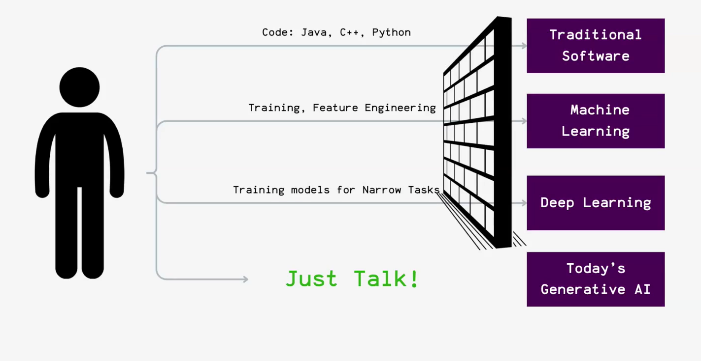
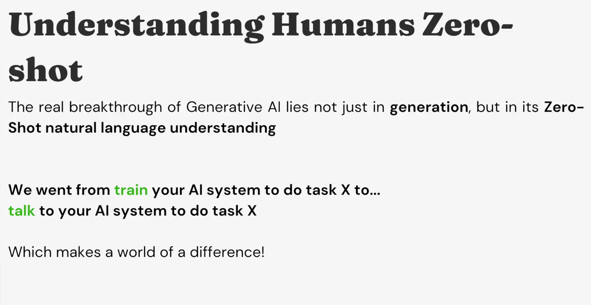

The breakthrough of Generative AI lies in its **zero-shot natural language understanding** — we can now simply **talk** to the AI to perform a task *X* instead of training it specifically.

Modern GenAI systems can understand and generate **text, images, and videos**.

---

## **Limitations of Generative AI and the Need for Agents**

Despite its creativity, **Generative AI cannot perform end-to-end tasks**.
For example, while it can suggest a travel itinerary, it cannot:

* Book tickets
* Remember user preferences
* Personalize results autonomously

Thus, the next challenge is enabling AI to **plan and execute tasks end-to-end**, interacting with existing APIs, tools, and software — this is where **Agentic AI** comes in.

---

## **Agentic AI Components**
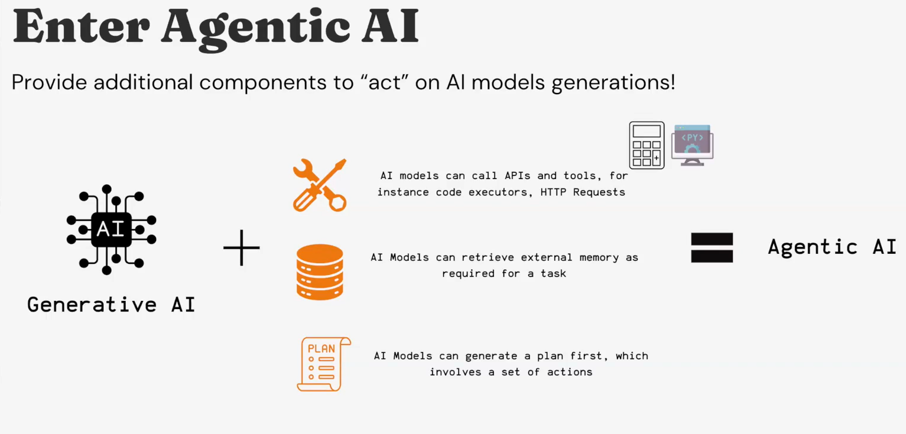
Agentic AI extends Generative AI by enabling it to **act** on its own outputs.

Its core components include:

1. **Tool and API Calling:**
   Models can call external tools (e.g., code executors, HTTP requests) to act on the world.
2. **External Memory Access:**
   Retrieve or store relevant information for long-term or contextual reasoning.
3. **Planning:**
   Generate a plan — a structured sequence of actions — before execution.

Its core components include:

1. **Tool and API Calling:**
   Models can call external tools (e.g., code executors, HTTP requests) to act on the world.
2. **External Memory Access:**
   Retrieve or store relevant information for long-term or contextual reasoning.
3. **Planning:**
   Generate a plan — a structured sequence of actions — before execution.
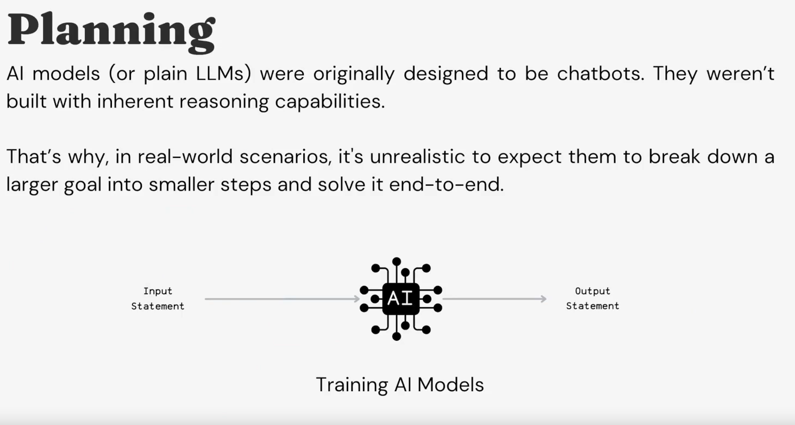
### **Reasoning Models (LRMs)**
### **Reasoning Models (LRMs)**

Standard LLMs were built as **chatbots**, not planners, so expecting them to decompose and solve multi-step tasks is unrealistic.
**Reasoning Models (LRMs)** are explicitly trained to handle reasoning and planning, producing both an answer and the thinking steps behind it.
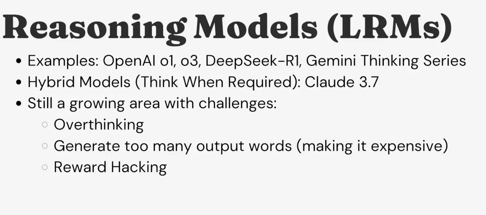
**Examples of LRMs:**

* OpenAI **o1**, **o3**
* **DeepSeek-R1**
* **Gemini Thinking Series**

**Hybrid Models:**
Models like **Claude 3.7** think or reason *only when necessary*, combining efficiency with reasoning depth.

---

## **Tool Calling and the Model Context Protocol (MCP)**

### **Tool Calling**
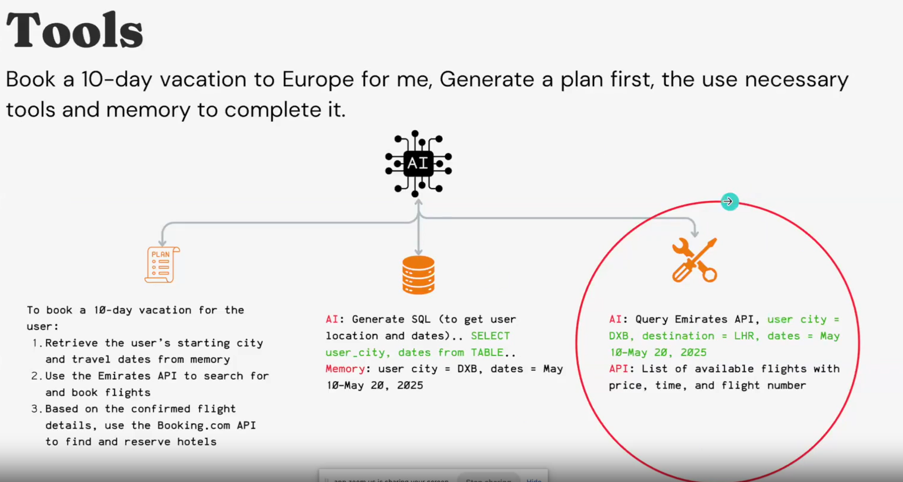
For AI to **act and reason** effectively, it must interact with the external world through **tools**.
OpenAI introduced **Function (Tool) Calling** in **June 2023**.

**Mechanism:**
**Mechanism:**

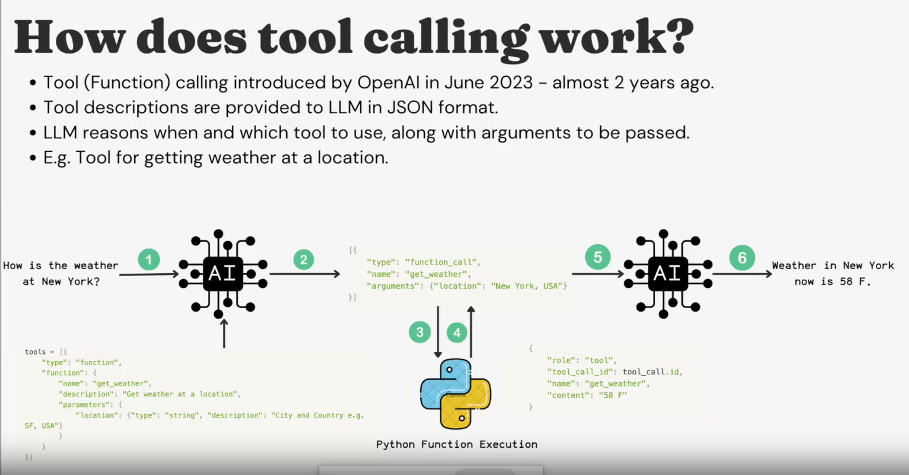
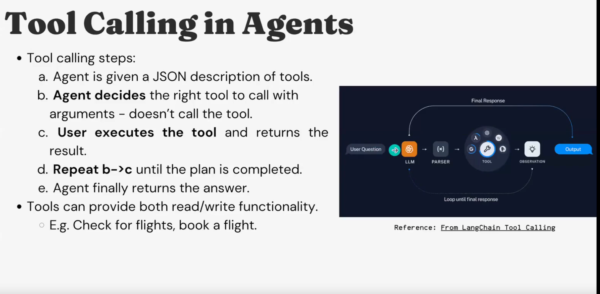
1. The LLM is provided with **tool descriptions** in JSON format.
2. It decides *when* and *which* tool to use, and *what arguments* to pass.
3. The **user or host executes** the tool and returns results.
4. The LLM continues planning and acting until the task completes.

**Example:**
A travel agent AI may call tools to:

* Check flights (read function)
* Book tickets (write function)

---

### **The Tool Specification Problem**

Different LLM providers (e.g., OpenAI, Anthropic, DeepSeek) use **incompatible tool specification formats** —
each with their own JSON schemas, request/response structures, and conventions.

This makes it hard to build one agentic application that works across multiple models and APIs.

---

## **The Model Context Protocol (MCP)**

The **Model Context Protocol (MCP)** addresses this issue by proposing a **Unified API/Protocol** for tool usage.

**MCP Standardizes:**

* How tools are described to LLMs
* How requests and responses are formatted
* How richer data types (e.g., audio, video) are handled

### **MCP Architecture**
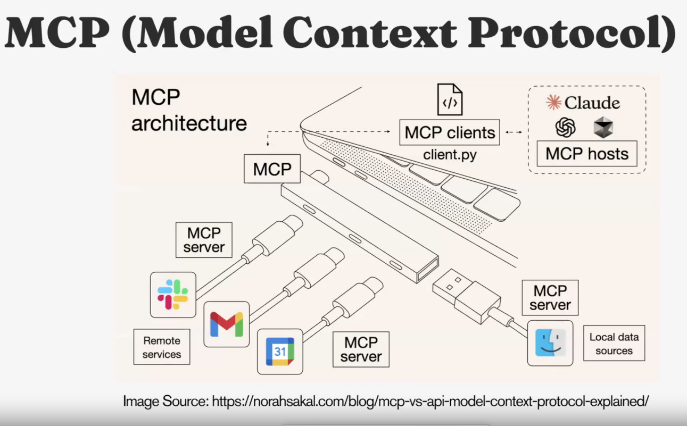
MCP follows a **Client-Server model**:

* **Server:** Executes tools and APIs
* **Client:** Communicates with the server via the MCP protocol
* **Host:** (e.g., Claude Desktop) integrates and manages communication between model and tools

**Goal:**
Enable **interoperability** — build tools once and use them with **any model, in any environment**.
This promotes developer productivity and faster AI adoption.

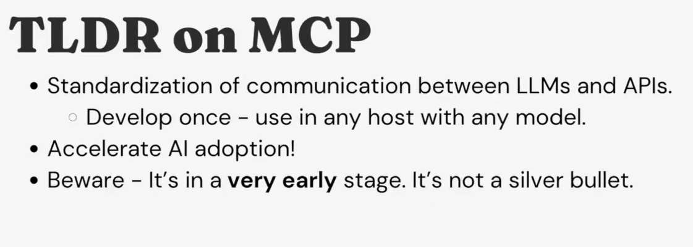

> ⚠️ MCP is still in an **early stage** and not a silver bullet — it’s an evolving standard.

---

## **Designing and Optimizing AI Applications**

A practical framework for building robust AI systems:

1. **Define the Scope**
   Clearly identify the user problem or workflow.

2. **Curate Data**
   Gather representative and high-quality data for the domain.

3. **Select the Model**
   Balance **Performance**, **Cost**, and **Latency**.
   (Remember: *90% of enterprise use-cases don’t need heavy reasoning models in version 1.*)

4. **Establish Evaluation Metrics**
   Use one or more:

   * Unit tests
   * Regression tests
   * Semantic similarity metrics
   * LLM-based evaluations

5. **Implement Monitoring**
   Continuously evaluate performance, accuracy, and user satisfaction.

---

### **Optimization Techniques**
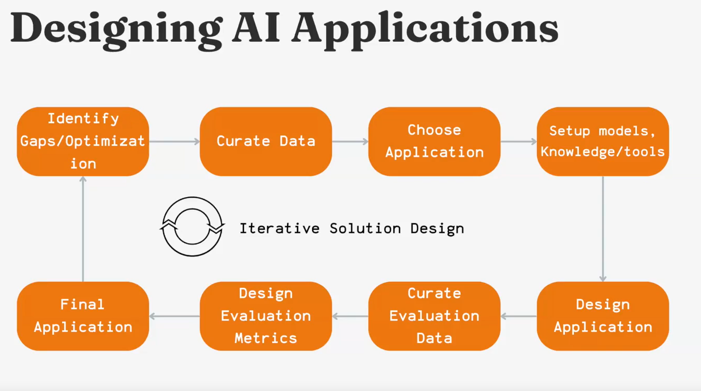
* **Reduce Hallucination:**
   Improve prompt design, retrieval context, or use Corrective RAG.

* **Enhance Tool Reliability:**
   Clarify tool definitions or employ **multi-agent systems** for coordination.
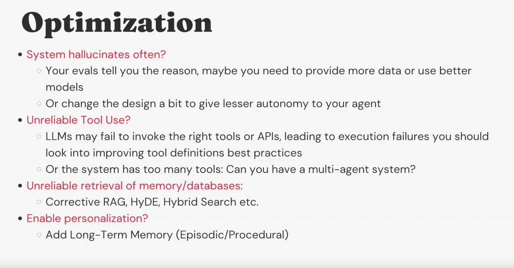
* **Improve Memory and Retrieval:**
   Use **Hybrid Search** or **Long-Term Memory (episodic/procedural)** for personalization.

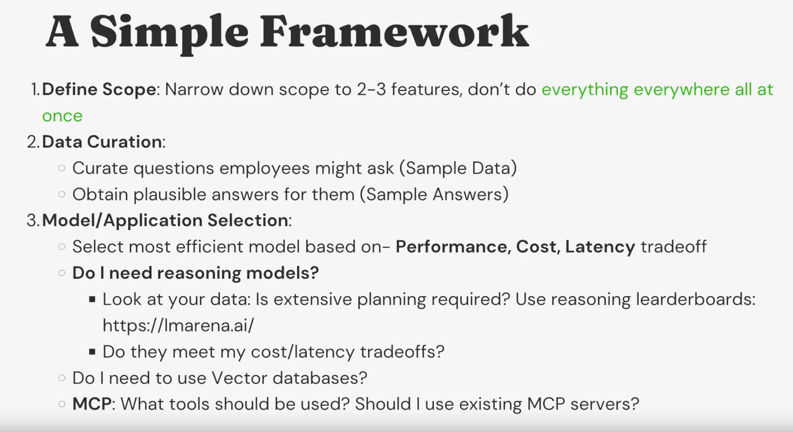
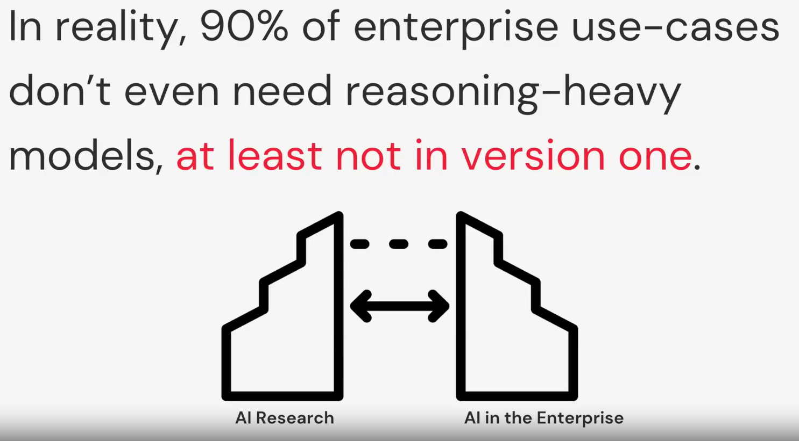
---

## **Key Mindset**

Treat every new advancement (reasoning, memory, or protocol) as an **addition** to your existing AI pipeline — not a replacement.
This modular, layered approach simplifies experimentation, debugging, and scaling of AI systems.

---

