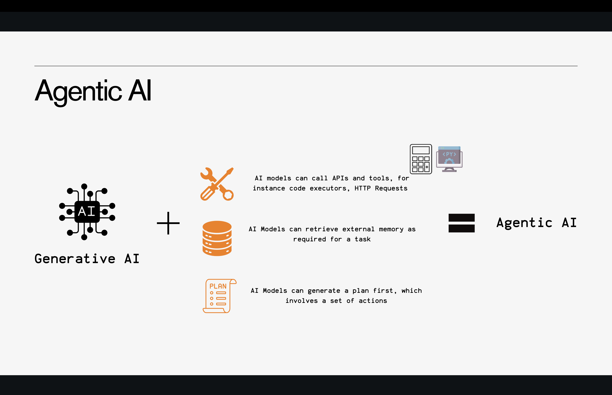
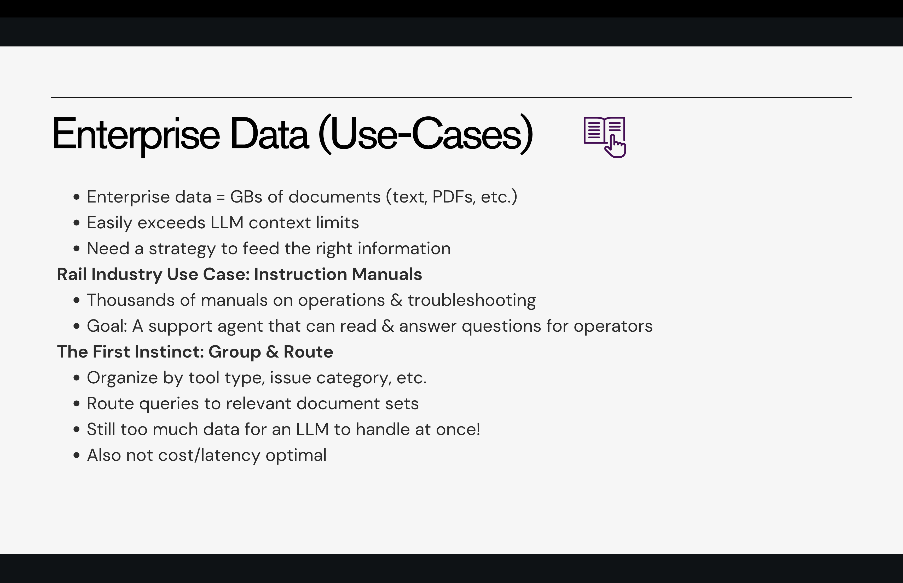
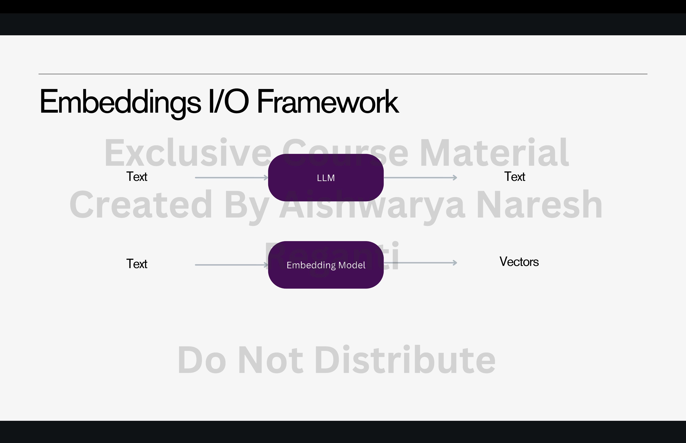
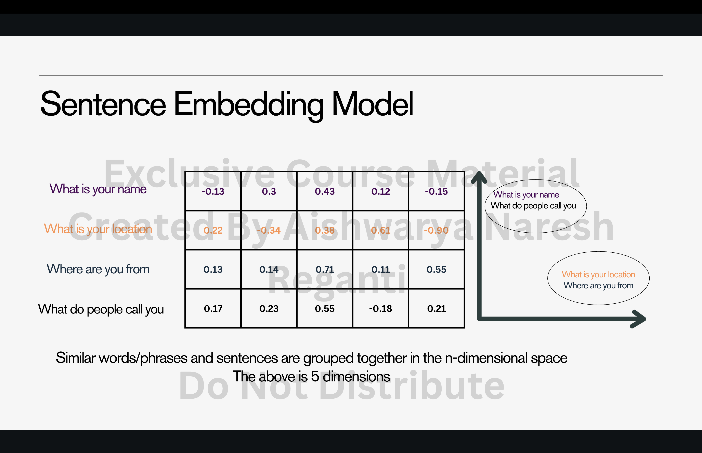
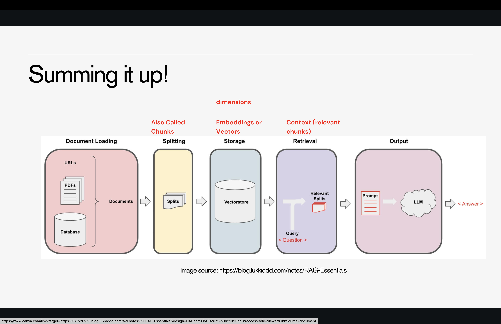
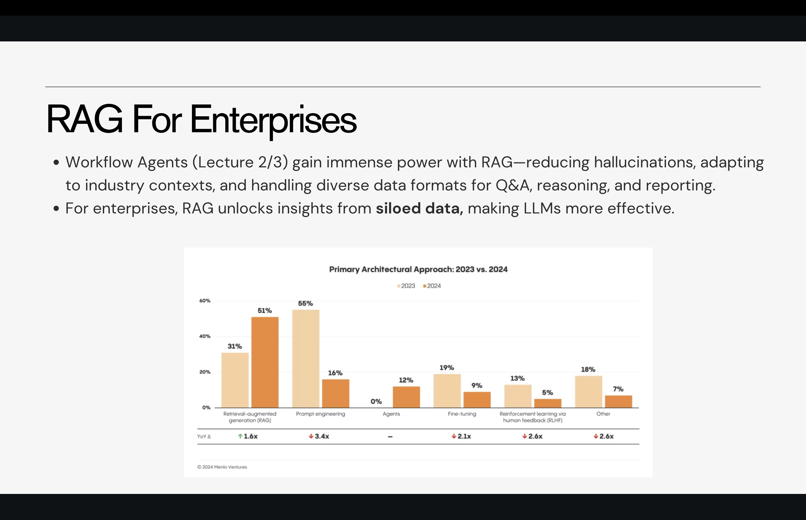

# RAG Introduction

# 1. What Is Agentic AI?

Agentic AI combines **Generative AI** with the ability to:

* Call APIs and external tools
* Retrieve and store information from memory
* Plan multi-step tasks
* Execute those plans autonomously

In other words, Agentic AI = **LLM + Tools + Memory + Planning + Execution**.

This is what allows AI systems to act, not just generate text.

---

# 2. The Challenge: Stateless Agents

Even advanced agents suffer from two fundamental limitations:

### **1. No Memory (Statelessness)**

LLMs forget everything outside the current conversation.
Feedback, preferences, and corrections do not persist unless explicitly stored.

### **2. Limited Context Window**

LLMs can only ingest data that fits inside the model’s context length.
Enterprises typically have **gigabytes** of documents, logs, manuals, contracts, and knowledge — far too large to fit into a prompt.

Because of these limitations, agents cannot maintain long-term knowledge or autonomously scale across large datasets.

---

# 3. The Solution: Retrieval-Augmented Generation (RAG)

RAG addresses these limitations by giving LLMs a way to access **external knowledge at query time** — without exceeding the model’s context window.

RAG enables:

* Contextual enrichment
* Retrieval of enterprise-specific information
* Use of memory across tasks
* Reduction of hallucinations
* Access to large-scale datasets in real time

RAG is foundational for building reliable enterprise AI systems.

---

# 4. What RAG Actually Does

RAG retrieves only the **most relevant information** from a large dataset and injects it into the LLM’s context *just in time*.

To do this, RAG relies on:

* Embeddings
* Vector search
* Chunking
* Retrieval pipelines

This requires building a **semantic search system** tailored to the enterprise’s data.

---

# 5. Embeddings and Vector Representations

Embeddings convert text into **dense numerical vectors** that represent meaning.
Two pieces of text with similar meaning will have embeddings that lie close together in high-dimensional space.

You can embed:

* Words
* Sentences
* Paragraphs
* Documents
* Images
* Audio

Embeddings allow AI models to compare meaning efficiently, enabling semantic search.

### Why embeddings matter:

* Traditional keyword search fails on semantic matches (“capital of France” vs “Paris”).
* Vectors capture meaning, not surface words.
* They support fuzzy matching and contextual understanding.

Similarity scores range from **0 to 1**:

* 0 → completely unrelated
* 1 → identical meaning

---

# 6. The RAG Workflow (Three Phases)

RAG systems operate in three clearly separated phases:

---

## **Phase 1: Ingestion (Offline)**

Before the system runs, you must prepare the data:

1. **Document Loading** — from PDFs, URLs, databases, images, etc.
2. **Chunking/Splitting** — breaking text into smaller pieces.
3. **Embedding** — converting chunks into vectors.
4. **Vector Storage** — saving those embeddings in a vector database.

This phase is computation-heavy but done once.

---

## **Phase 2: Retrieval (Real-Time)**

At query time:

1. The user sends a question.
2. The system embeds the question.
3. It searches the vector database for similar chunks.
4. It returns the most relevant chunks (Top-K retrieval).

This creates a context pack that will be added to the prompt.

---

## **Phase 3: Generation**

The LLM receives:

* The user query
* The retrieved context

It then generates the final answer.

This is where hallucination reduction, factual grounding, and personalization occur.

---

# 7. Enterprise RAG

Enterprise RAG enhances workflow agents by:

* Ensuring factual grounding
* Personalizing answers based on internal data
* Integrating with documentation, logs, chats, manuals
* Reducing hallucinations significantly
* Supporting diverse data formats

However — **every new component must be evaluated**.

---

# 8. RAG Evaluation Metrics

Evaluation is essential.
RAG performance is measured across two main categories:

---

## **A. Retrieval Metrics** (How well did we fetch relevant data?)

### **1. Context Recall**

Did the correct document appear in the Top-K results?

Example:
If an answer requires 8 relevant chunks but only 4 appear → recall = **50%**.

---

### **2. Context Precision**

Of the retrieved chunks, how many are relevant?

Example:
If 10 chunks were returned but only 4 were useful → precision = **40%**.

High recall + low precision → too much noise.
Low recall + high precision → missing important items.

---

### **3. MRR (Mean Reciprocal Rank)**

Evaluates how early the first relevant chunk appears.

---

### **4. NDCG (Normalized Discounted Cumulative Gain)**

Rewards retrieval systems that rank the most important chunks higher.

---

## **B. Generation Metrics** (How well did the LLM use retrieved data?)

### **1. Faithfulness/Hallucination Rate**

Checks if the answer is grounded in retrieved data.

* Fully Faithful → No hallucinations
* Partially Faithful → Some correct info + some wrong additions
* Not Faithful → Unsupported answer

---

### **2. Relevance**

Is the answer appropriate and aligned with the user's query?

---

### **3. Factuality**

Is the information true and verifiable?

---

### **4. Fluency and Coherence**

Does the answer read well?

---

# 9. RAG Metrics Table (Conceptual Summary)

| What we test | What we compare                  | Metrics used                                 |
| ------------ | -------------------------------- | -------------------------------------------- |
| Retrieval    | Retrieved chunks vs ideal chunks | Recall, Precision, MRR, NDCG                 |
| Generation   | Model output vs ideal answer     | Faithfulness, Relevance, Fluency, Factuality |

---

# 10. Implementation Components of Enterprise RAG

Enterprise RAG is not just retrieval + generation. It requires multiple components.

---

## **1. Document Parsing**

### Traditional OCR tools:

* Amazon Textract
* EasyOCR
* Docling

### When documents contain tables, charts, or messy formatting:

Use multimodal models (GPT-4o, Mistral OCR, etc.).

Document parsing quality affects the entire RAG pipeline.

---

## **2. Chunking**

Chunk size determines retrieval quality.

### **General rule:**

**Chunk size = 5–10× answer length**

But there are many exceptions.

### Example: Simple Factoid Query

Question: “What is the capital of France?”
A small chunk of 5–20 tokens is sufficient.

### Example: Complex Explanation

If chunks are too small:

* Retrieval becomes fragmented
* The LLM cannot reconstruct meaning
* Answers become disjointed

Increasing chunk size to **300–400 tokens** often restores coherence.

### Chunking Strategies:

| Strategy          | Best for             | Description                     |
| ----------------- | -------------------- | ------------------------------- |
| Fixed-Length      | Manuals, legal docs  | Simple splitting by token count |
| Sentence-Based    | Articles, essays     | Natural-language boundaries     |
| Paragraph-Based   | Long-form text       | Coherent sections               |
| Semantic Chunking | Code, technical docs | Based on topic shifts           |
| Hybrid            | General RAG          | Combines multiple strategies    |

---

## **3. Embedding Models**

Choose based on:

* MTEB leaderboard scores
* Languages supported
* Dimensionality
* Domain performance

Embeddings directly determine retrieval quality.

---

## **4. Vector Databases**

Capabilities vary widely.
Consider:

* Vector search (semantic similarity)
* Keyword search (e.g., BM25)
* Geo search
* Text-only vs multimodal embeddings
* Cost and scalability

---

# 11. Common Enterprise RAG Challenges

Over **80% of enterprise RAG systems struggle with retrieval**.

The typical problems are:

### **1. Retrieval Problems**

* Wrong chunks retrieved
* Missing key chunks
* Too much noise
* Poor chunking strategy

### **2. Generation Problems**

* The LLM ignores context
* The LLM hallucinates beyond the retrieved data
* Context is too fragmented

### **3. Performance Optimization**

Balancing:

* Cost
* Latency
* Accuracy
* Recall/precision trade-offs

---

# ⭐ Final Takeaway

RAG is fundamental for building real-world enterprise AI systems.
It solves statelessness, context limitations, and hallucination issues by connecting LLMs to **external knowledge** through a retrieval pipeline.

When implemented well, RAG enables:

* Reliable factual grounding
* Personalized responses
* Scalable knowledge access
* More capable workflow agents
* Safer, more accurate outputs

But RAG requires careful design:
Document parsing → chunking → embeddings → vector search → retrieval → evaluation.

Each component matters, and each one must be evaluated continuously.

---

## What is Agentic AI?

Agentic AI is defined as the combination of **Generative AI** plus the capacity for AI models to call APIs and tools (such as code executors or HTTP Requests), retrieve external memory as required for a task, and generate a plan which involves a set of actions.

## The Challenge: Stateless Agents

The most significant issue with agents is that they are **stateless (They forget)** and can only consume information limited by their context length. This limitation manifests in two ways:

1. **Memory:** Any feedback or improvements provided through the prompt are short-lived and do not support continuous learning.
2. **External Context:** In enterprise environments, there are often **GBs of data** to learn from.

## The Solution: Retrieval-Augmented Generation (RAG)

The challenge is how to enrich agents with contextual information, specifically by:
- Providing enterprise-specific context
- Storing and updating the memory of past conversations 
- Dynamically incorporating relevant information from large datasets that do not fit within the LLM's context length

**Retrieval-Augmented Generation (RAG)** plays a crucial role in solving this challenge, as it is a fundamental concept for most knowledge augmentation tasks.

---

## Retrieval Augmented Generation (RAG)

RAG is defined as a technique that helps process large volumes of data by efficiently retrieving and optimizing the most relevant information before passing it to a Large Language Model (LLM). To find relevant data within a large pool of information, it is necessary to **Build a Search System**. The most common form of this system is called **semantic search**.

---

## Embeddings and Vectors

* AI models convert context into **embeddings**, which are numerical representations of text that capture meaning and relationships.
* Embeddings transform text (words, sentences, or entire documents) into **dense vectors** in a high-dimensional space. This allows AI to compare meanings efficiently and ensures the AI understands context beyond just words.
* In the **Embeddings I/O Framework**, text is processed by an **Embedding Model** to output vectors, which can then be used by the LLM. Similar words, phrases, and sentences are grouped together in this n-dimensional space (for example, the sources show a 5-dimension attribute space).

---

## Calculating Similarity

* **Semantic similarity** (or **Vector Similarity**) measures how close two pieces of text (words, phrases, or sentences) are in meaning by calculating the distance between their embeddings (vector representations).
* **High semantic similarity** means the texts have nearly the same meaning.
* **Low semantic similarity** means the texts are very different in meaning.
* Similarity is viewed as a score from 0 to 1:

  * **0.0** → No similarity (completely different meanings).
  * **0.5** → Somewhat related (partial overlap in meaning).
  * **1.0** → Identical meaning (very close in context).

---

## The RAG Workflow Phases

The RAG process is divided into three distinct phases:

### Phase 1: Ingestion Phase (Offline Phase)
This process happens offline before the application runs. The steps include **Document Loading** (from URLs, PDFs, or a Database) → **Splitting** (the documents are split into parts, also called **Chunks**) → **Storage** (the chunks/splits are stored as **Embeddings or Vectors** in a **Vectorstore**).

### Phase 2: Retrieval Phase
This phase is done in real time after receiving the user query. The user query is used to search the Vectorstore, which outputs **relevant data** or **Relevant Splits** (also referred to as Context or relevant chunks). The Vectorstore/database uses vector representations to calculate similarity, but retrieves the text format since AI models process and understand text more effectively.

### Phase 3: Generation Phase
This involves constructing a final prompt by adding the user query + retrieved context, and providing this to the LLM. The LLM processes this **Prompt** to generate the final **Answer** (Output).

---
# Enterprise RAG

In AI systems, every time you add a new component, it has to be evaluated.

### **Evaluating RAG Systems (RAG Metrics)**

Evaluation is essential whenever a new component is added to an AI system. Metrics are split into two categories:

**1. Retrieval Metrics** (Assess how well relevant documents are retrieved):

* **Context Recall:** Measures how often the correct document appears in the top K retrieved results. Example: A chunk recall of **50% (4/8)** means half of the necessary information was missed.
* **Context Precision:** Measures the proportion of relevant documents/chunks among the top K retrieved. Example: A precision of **40% (4/10)** means 60% of the retrieved data was noise. A combination of 40% Precision and 50% Recall indicates the system is retrieving too much noise while missing important information.
* **MRR (Mean Reciprocal Rank):** Evaluates how high the first relevant document appears.
* **NDCG (Normalized Discounted Cumulative Gain):** Weighs the relevance of retrieved documents, giving more importance to higher-ranked documents.

**2. Generation Metrics** (Can be semantic match or LLM Judges):

* **Faithfulness/Hallucination Rate:** Measures alignment between the generated response and the retrieved documents.

  * **Fully Faithful:** Response aligns completely with the relevant data.
  * **Partially Faithful:** Response includes relevant information but also introduces unsupported details.
  * **Not Faithful:** Response is not supported by the provided data and may contain hallucinations.
* **Relevance:** Evaluates if the response is useful and contextually appropriate.
* **Fluency:** Checks if the output is coherent and well-structured.
* **Factuality:** Ensures the generated response is factually accurate.

---

## **RAG Metrics**

| **Input Prompt** | **Ideal Context (Ideal Chunks)**                             | **Predicted Context**                          | **Retrieval Metrics**                          | **Ideal Response**            | **Predicted Response** | **Generation Metrics**                         |
| :--------------- | :----------------------------------------------------------- | :--------------------------------------------- | :--------------------------------------------- | :---------------------------- | :--------------------- | :--------------------------------------------- |
| **Data Point 1** | Ground truth chunks that ideally contain the correct context | Context retrieved by the system (top-k chunks) | *Context Recall, Context Precision, MRR, NDCG* | Ground truth answer           | Model-generated answer | *Faithfulness, Relevance, Fluency, Factuality* |
| **Data Point 2** | Ground truth chunks for reference                            | Retrieved context for this query               | *Recall@k, Precision@k*                        | Expected output text          | Generated response     | *Hallucination Rate, Coherence*                |
| **Data Point 3** | Annotated or ideal supporting text                           | Retrieved content by retriever                 | *NDCG, Coverage*                               | Human-verified correct output | System output          | *Helpfulness, Faithfulness, Factual Accuracy*  |

---

The contents cover **Retrieval-Augmented Generation (RAG) for Enterprises**, detailing the system's architecture, key implementation steps like **Document Parsing** and **Chunking**, the selection of **Embedding Models** and **Vector Databases**, and the methods for **Evaluating RAG Systems** using retrieval and generation metrics.

**RAG for Enterprises** is shown to provide immense power to Workflow Agents by **reducing hallucinations**, adapting to industry contexts, and handling diverse data formats, ultimately unlocking insights from siloed data. The core pipeline involves Document Loading, Splitting (Chunking), Storage of Embeddings, Retrieval of relevant chunks, and Output generation via a Large Language Model (LLM).

Crucial decision factors for Enterprise RAG include determining how documents should be **chunked** (using strategies like Fixed-Length or Semantic Chunking), selecting models for generating **vectors** (often benchmarked using the MTEB Leaderboard), and addressing common retrieval challenges faced by 80% of systems.

System performance is evaluated using **RAG Metrics**:

1. **Retrieval Metrics** assess document quality, including **Context Recall** (how often the correct document is retrieved) and **Context Precision** (the proportion of relevant retrieved chunks compared to noise).
2. **Generation Metrics** assess the LLM output, focusing on **Faithfulness/Hallucination Rate** (alignment with retrieved data), Relevance, Fluency, and Factuality. Evaluation is crucial whenever a new component is added to an AI system.

---

RAG provides immense power to Workflow Agents by **reducing hallucinations**, adapting to industry contexts, handling diverse data formats, and unlocking insights from **siloed data**, making Large Language Models (LLMs) more effective. The RAG pipeline consists of:

1. **Document Loading:** Loading documents (URLs, PDFs, Databases).
2. **Splitting (Chunking):** Breaking documents into smaller pieces.
3. **Storage:** Storing **Embeddings** (or Vectors) in Vectorstores.
4. **Retrieval:** Using a user query to retrieve relevant context (chunks).
5. **Output:** Generating a response from the LLM using the final prompt (user query + relevant data).

### **Key Implementation Components**
Here is the extracted text from your screenshot, with links preserved exactly as in your document:

***

1. **Document Parsing**

1. **Traditional OCR Methods**
    - [Amazon Textract](https://aws.amazon.com/textract/) – Ideal for structured documents.
    - [EasyOCR](https://github.com/JaidedAI/EasyOCR) – Open-source and supports multiple languages.
    - [Docling](https://github.com/doclingjs/docling) – A powerful open-source document parsing tool.
2. **Handling Images and Charts:** Use Multimodal Embeddings (should be handled separately, next section)
3. **When PDFs are Clumsy: Use Multimodal Models**
    - Models like [GPT-4o](https://openai.com/blog/gpt-4o) can directly process images, extract text, and even interpret tables, charts, and handwriting.
    - These models understand context, making them useful for messy or unconventional document formats.
    - Latest, Mistral: [https://mistral.ai/news/mistral-ocr](https://mistral.ai/news/mistral-ocr)
    - Use with caution: [https://huggingface.co/spaces/echo840/ocrbench-leaderboard](https://huggingface.co/spaces/echo840/ocrbench-leaderboard)

2. **Chunking:** The chunk size should ideally be **5–10x the answer length**, though exceptions exist. An optimal chunk size for individual facts is **~50–100 tokens**. If chunks lack coherence or are too small, the model struggles; increasing chunk size to **300–400 tokens** can provide fuller context. Chunking strategies include:

| Chunking Strategy          | Best For                            | How It Works                                           |
|---------------------------|-----------------------------------|-------------------------------------------------------|
| Fixed-Length Chunking      | Structured text (e.g., legal docs, manuals) | Splits text into equal-sized chunks (e.g., 512 tokens). Simple but may break context. |
| Sentence-Based Chunking    | Natural language (e.g., articles, essays) | Splits at sentence boundaries to preserve meaning.     |
| Paragraph-Based Chunking   | Long-form text (e.g., books, reports) | Preserves logical sections but chunks may vary in size. |
| Semantic Chunking (Adaptive) | Code, research papers, technical docs | Uses text embeddings to detect semantic breaks (e.g., topic shifts). |
| Hybrid Chunking            | General-purpose RAG                | Mixes sentence + paragraph chunking + overlap for best recall and precision. |

***
Here is the text from your third screenshot, exactly as it appears:

***

2. Chunking

Example 1: Short Answers → Small Chunks  
Input:  
User Query: What is the capital of France?  
Chunks Available:  
Chunk 1: "Paris is the capital of France."  
Chunk 2: "France is located in Western Europe."  
Chunk 3: "Paris has a population of over 2 million."

Generated Answer: Paris.

The system only needed one small chunk (less than 10 words) to answer correctly.  
Using larger chunks would be wasteful here.  
Optimal Chunk Size: ~50-100 tokens (so individual facts stay contained).

***
2. Chunking

Example 2: Too Many Chunks Retrieved → Chunk Size Too Small

User Query: Explain quantum entanglement in simple terms.

Chunks Retrieved (too small):

Chunk 1: "Quantum entanglement is a phenomenon in physics."
Chunk 2: "It occurs when two particles remain connected."
Chunk 3: "Even when separated by a great distance."
Chunk 4: "A change in one instantaneously affects the other."

Generated Answer: (Fragmented and unclear) Quantum entanglement is a phenomenon in physics. It occurs when two particles remain connected. Separated by a great distance. A change in one instantaneously affects the other.
-  Problems
    ○ The retrieved chunks lack coherence since they are too small.
    ○ The model is struggling to stitch them together properly.

Increase chunk size to 300–400 tokens, so the retrieval provides fuller context rather than fragments.

Your chunk size should be 5–10x the answer length, but exceptions exist:
    -  If the answer spans multiple documents, smaller chunks improve diversity.
    -  If the task requires reasoning or synthesis, large chunks may reduce context mixing.
    -  For structured data (code, logs), chunking should follow logical units.
    -  For subjective/exploratory queries, smaller chunks with broader retrieval work better.

In these cases, the 5–10x rule doesn’t always hold and should be adjusted based on retrieval quality.

3. **Embedding Models:** Selecting the right embedding model is informed by the **MTEB Leaderboard** (Massive Text Embedding Benchmark), which covers 8 tasks and 58 datasets (including Clustering, Retrieval, and Classification). Parameters to consider include the number of parameters, tokens supported, and multilingual support.

EmbeddingModels.png
Embeddings.png
4. **Vector Databases:** These databases support **Vector search** (embedding similarity), **Keyword Search** (like BM25), and **GeoSearch**. They may support embeddings for **Text only** or for **Images/Videos (Multimodal RAG)**.
4. Vector Databases

-  What kind of search do they support?
    ○ Vector search (embedding similarity)
    ○ Keyword Search (Dresses under 49$) Eg. BM25
    ○ GeoSearch “Find coffee shops near me that match my taste”

-  Embedding Support:
    ○ Text only
    ○ Images/Videos (Multimodal RAG)

-  API Support:
    ○ LangChain etc.

-  Other factors: Vector dimensions (length), cost etc.
Link: https://superlinked.com/vector-db-comparison

### **Enterprise RAG Decision Factors and Challenges**

Key decisions revolve around how documents are chunked, which models generate vectors, and how the retrieval pipeline is set up. **80% of enterprise RAG systems face challenges with retrieval**. Challenges include:

* **Retrieval Problems:** What if retrieved chunks do not contain the right answers?
* **Generation Problems:** What if the model cannot access information from context?
* **Optimization:** Focuses on **Cost/Latency** and **Performance**.

80% of enterprise RAG systems face challenges with retrieval!

---

