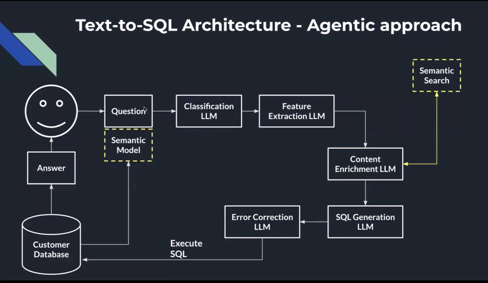

# **Understanding Key Design Principles in RAG, Retrieval, Chunking, and Text-to-SQL Systems**

This section summarizes important practical lessons for building enterprise-grade AI systems. It focuses on context engineering, chunking strategy, retrieval behavior, text-to-SQL architecture, and real-world challenges when working with large documents and business data.

---

# **1. How Document Size Impacts LLM Performance**

### **Small Documents (< 50 pages)**

These usually fit into a model’s context window without losing accuracy. A single-pass inference is often enough.

### **Large Documents (> 100 pages)**

Models *can* still fit them into context, but accuracy declines as documents grow. This happens because:

* The model struggles to attend to all parts of a long document.
* Important details may be “lost in the middle.”
* Token cost and latency increase drastically.

A dense 100+ page document can take **minutes** to process in one go.
But if the same document is chunked into ~15–20 pieces (≈350 tokens each), inference times drop to **seconds**.

**Takeaway:** Even with large context windows, *feeding everything at once* is rarely optimal. Well-structured chunking outperforms brute-force long-context.

---

# **2. Real-World Chunking Example: Legal Documents**

A typical enterprise legal dataset may include:

* Contracts since the 1950s
* 400+ pages each
* Dozens of amendments
* Complex cross-references

### Example query:

> “Is the liability under person X or person Y?”

A good answer must cite the original contract terms *and* check for amendments.

### What experiments showed:

* **5 chunks (~350 tokens)** → not enough context
* **25 chunks** → too much latency + too many irrelevant details
* **Optimal:** **10–15 chunks of 350–500 tokens each**

This “sweet spot” held true across major models such as OpenAI, Anthropic, and Google.

### Other improvement factors:

* Enriching chunks with **metadata** (titles, timestamps, clause types) increases accuracy.
* Human SME oversight is extremely important.
* A smaller model can match a larger model **if you provide the right chunks** → saving cost and latency.

---

# **3. Why Text-to-SQL Is Critical in Enterprises**

Databases remain the most reliable source of truth. They:

* Store **facts**, not probabilities
* Return **deterministic results**
* Handle huge volumes of structured data efficiently

LLMs, on the other hand:

* Are excellent at **understanding natural language**
* Are **probabilistic**, not deterministic

If the business asks:

> “What were my sales in 2024?”

You cannot answer with “approximately $15M.”
You need an exact value from SQL.

### Therefore → AI must **translate natural language to SQL** instead of “guessing” numbers.

---

# **4. Key Business Challenges in Analytics Workflows**

1. BI dashboards become outdated quickly.
2. By the time analysts produce a report, business questions have changed.
3. Chatbots created expectations of real-time self-serve insights.
4. Enterprise data is not always clean, cataloged, or documented.

This is why text-to-SQL systems are powerful: they allow business users to ask questions in natural language and retrieve live, accurate data.

---

# **5. Real-World Example: Sales & Payments**

A fintech processor receives **thousands of transactions per minute**.

### Example query:

> “What is the total transaction amount for merchant ABC?”

Issues discovered:

* “Merchant ABC” is not stored under that name in the database.
* It may be a business alias.
* The LLM doesn’t understand internal relationships between tables.

**Lesson:** SQL generation requires business ontology and schema knowledge, not just text understanding.

---

# **6. Modern Text-to-SQL Architecture (Agentic Approach)**

A robust text-to-SQL system is not a single LLM. It is an *agentic pipeline*:

1. **Question Classification**
   Identify the query type (aggregation? lookup? comparison?).

2. **Feature Extraction**
   Extract entities, time ranges, metrics, filters.

3. **Semantic Search**
   Retrieve relevant schema, descriptions, business definitions.

4. **Context Enrichment**
   Combine user question + schema context + ontologies.

5. **SQL Generation**
   Draft SQL based on enriched context.

6. **Error Correction**
   Validate SQL; ensure tables and columns exist.

7. **Execute SQL**
   Run against the customer database.

8. **Return Final Answer**
   Format and summarize results.

This architecture isolates responsibilities, reducing the chance of hallucinated SQL.

---

# **7. Text-to-SQL: Key Considerations**

### **Provide a Business Ontology**

The LLM must understand:

* Business terms
* Entity mappings
* Internal names vs. external labels

Example: internal merchant name ≠ user-facing merchant name.

### **Separate Domains**

Keep finance, sales, HR, logistics schemas separate to reduce confusion as the number of queries grows.

### **Use Semantic Search for Validation**

If the schema doesn’t directly match the question, semantic search fills the gap by finding related fields or tables.

### **Iterate with SMEs**

LLMs alone cannot infer hidden business relationships. SMEs must refine the schema or context.

---

# **8. Overall Lessons Across All Topics**

### **1. Context engineering beats prompt engineering**

Models perform best when *given the right information*, not when given longer or "clever" prompts.

### **2. Chunking is crucial**

The right chunk size often matters more than which LLM you choose.

### **3. Retrieval quality determines system quality**

Most enterprise RAG problems stem from poor retrieval, not poor generation.

### **4. Tool-use and SQL generation require structure**

Agents need reliable pipelines, ontologies, and validation layers.

### **5. SMEs are essential**

Domain experts are the only source of truth for business-specific reasoning.

---
