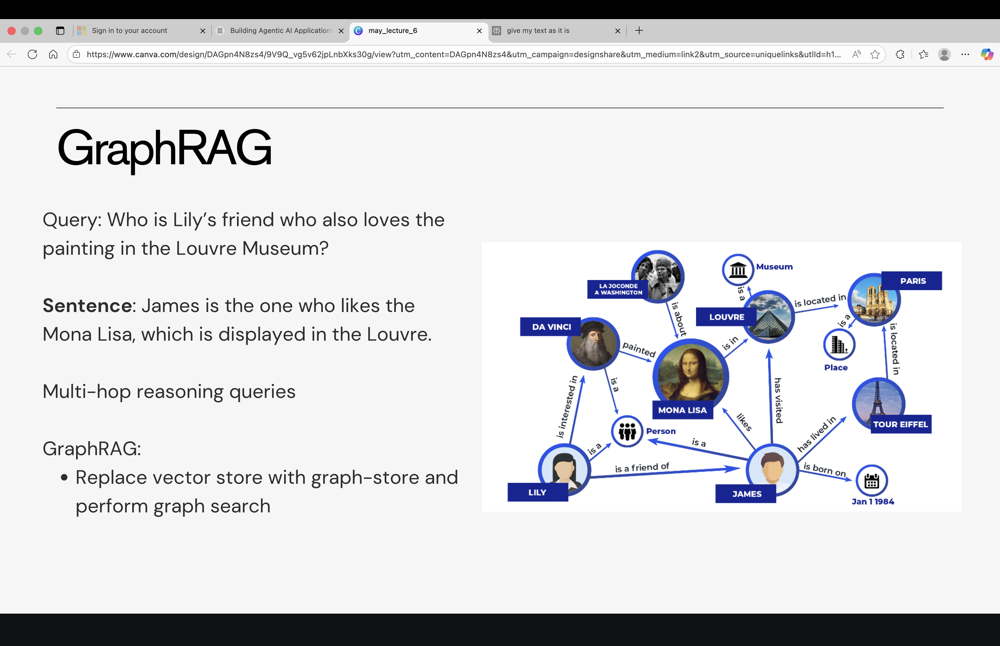
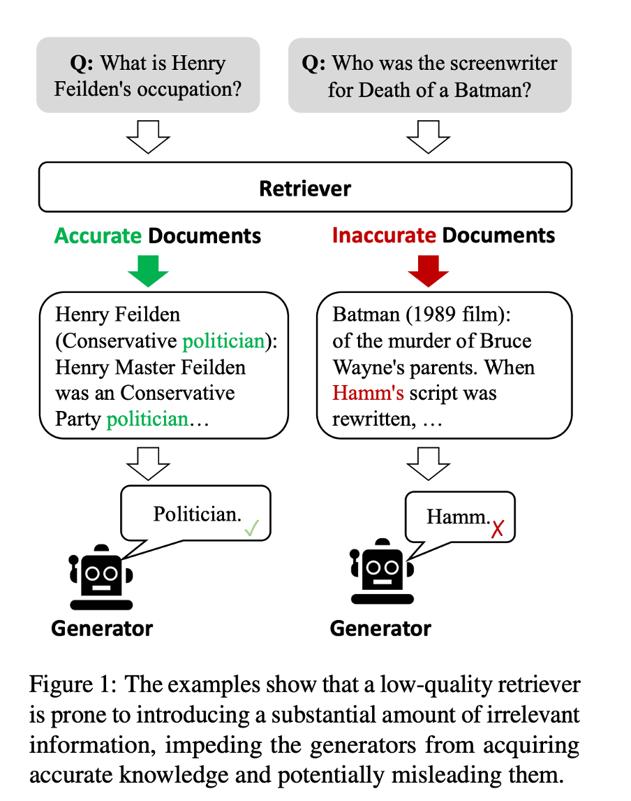
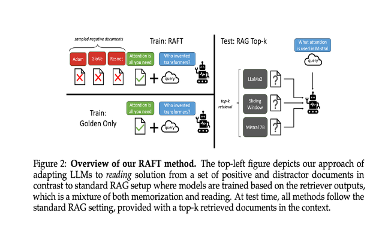
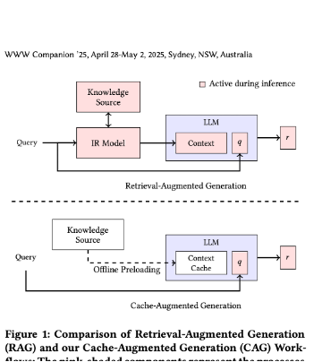
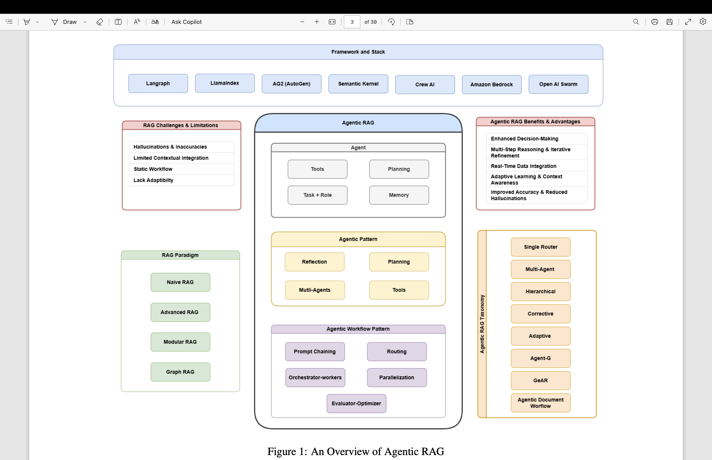

# Advanced RAG Methods

## Enterprise Issues & Solutions

### 1. Retrieval Issues

- **KB Gaps – Data Is Not Present in the Knowledge Base**
  - **Problem:** The answer isn't found because the necessary information isn't in your document collection.
  - **Solution:** Expand Your KB: Ingest additional documents or update your index with new data.
  - **Example:** If you ask, "What are the specs of the iPhone 15?" but your KB only has older models, you need to add the latest product release notes.

- **Data Is Present but Not Retrieved**
  - **Problem:** The needed data exists but isn't being matched to your query due to phrasing or indexing issues.
  - **Solution:** Improve how the query is interpreted before matching to the KB.

## Popular Methods

### Easy (low effort)
- Query Rewriting
- Query Decomposition
- HyDE

### Medium:
- GraphRAG
- Hybrid Search (different search method)

### Advanced:
- Corrective RAG
- Fine-tuned retrieval models

## Query Rewriting/Decomposition

### Query Rewriting/Expansion (LangChain)

The system automatically reformulates the query into an alternative phrasing that is more likely to match the stored data (Use LLM).

**Examples:**
- Transforming "What are the latest UI upgrades?" into "List recent user interface improvements" can help retrieve documents that use different wording.
- In healthcare, "heart attack" query expansion might add "myocardial infarction" so that documents using either term can be retrieved.

### Query Transformations

### Query Decomposition

A complex question is broken down into simpler sub-questions that are easier for the retriever to match.

**Example:**
- **Original Query:** "How do electric cars work and what are their benefits?"
- **Decomposed Queries:**
  - "How do electric cars operate?"
  - "What are the benefits of electric cars?"

Then the system combines the answers.

---

**Query Example:**
```
How do electric cars work and what are their benefits?
↓
How do electric cars operate?
What are the benefits of electric cars?
```

**Sample Responses:**
- Electric cars operate using charging ports that...
- Electric cars have some benefits
- All cars have some benefits

# HyDE

# HyDE (Hypothetical Document Embeddings)
The model generates a “hypothetical” answer or summary based on the query, and then uses that generated text to perform the search.
User Query: “What are the benefits of renewable energy?”
HyDE Process:
-  The model produces a hypothetical answer like: “Renewable energy reduces greenhouse gas emissions, lowers energy costs over time, and creates sustainable jobs while providing energy independence.”
-  This detailed summary captures additional aspects (environmental, economic, and social benefits), improving the chance of retrieving a wide array of relevant documents.

# Hybrid Search (Different Search Methods)

-  How It Works: Combines traditional keyword-based search (like BM25) with semantic (vector-based) search to cover cases where one method alone might miss relevant documents.
-  More advanced approaches: Multi-vector searches
Query: All crime incidents that happened on 25th December
Documents:
  -  Use keyword search to get all incidents where data == 25th December
  -  Filter “crime incidents” based on embedding search

# GraphRAG



Query: Who is Lily’s friend who also loves the painting in the Louvre Museum?

Sentence: James is the one who likes the Mona Lisa, which is displayed in the Louvre.

Multi-hop reasoning queries

GraphRAG:
-  Replace vector store with graph-store and perform graph search

# Corrective RAG



The Corrective Retrieval Augmented Generation (CRAG) method is proposed to address fundamental limitations in existing language models, specifically the issue of hallucinations in Large Language Models (LLMs) and the heavy reliance of standard Retrieval-Augmented Generation (RAG) on the relevance and accuracy of its initial document retrieval. LLMs inherently manifest hallucinations because their accuracy cannot be secured solely by the parametric knowledge they encapsulate, often struggling with factual errors. While RAG serves as a practical complement, its effectiveness fails when retrieval returns irrelevant or inaccurate results, which can mislead the generator.

CRAG is designed as a plug-and-play method to self-correct the retriever's results and enhance the efficient utilization of retrieved documents, demonstrating adaptability across various RAG-based approaches, including standard RAG and state-of-the-art Self-RAG.


https://arxiv.org/pdf/2401.15884

### Core Mechanism: Retrieval Evaluation and Action Triggering

The central element of CRAG is a lightweight retrieval evaluator that assesses the overall quality of retrieved documents for a given query and quantifies a confidence degree. This evaluation is critical for ensuring informative generation by reviewing the relevance and reliability of the retrieved documents.

Based on the quantified confidence degree, CRAG triggers one of three distinct knowledge retrieval actions:

1.  **Correct Action:** This action is triggered if the confidence score of at least one retrieved document exceeds an upper threshold, signaling the presence of relevant documents.
    *   **Strategy:** The retrieved documents undergo **Knowledge Refinement** using a decompose-then-recompose algorithm. This process extracts the most critical knowledge strips, filtering out non-essential or irrelevant information to optimize the utilization of this internal knowledge.

2.  **Incorrect Action:** This action is triggered when the confidence scores of *all* retrieved documents fall below a lower threshold, indicating they are irrelevant and unhelpful.
    *   **Strategy:** The initial retrieved documents are discarded, and large-scale **web searches** are utilized as a strategic extension for correction, providing complementary external knowledge. The input query is rewritten into keyword queries by a Query Rewriter (e.g., GPT-3.5 Turbo is used to mimic search engine usage).

3.  **Ambiguous Action:** This intermediate action is executed when the evaluator cannot confidently determine whether the result is correct or incorrect.
    *   **Strategy:** This soft, balanced approach combines both types of processed knowledge: the Internal Knowledge derived from the refinement of the initially retrieved documents and the External Knowledge obtained from web searches. The design of the Ambiguous action helps to mitigate the system's dependence on the absolute accuracy of the retrieval evaluator and enhances the overall robustness of the system.

The retrieval evaluator itself is based on a fine-tuned lightweight T5-large model (0.77B parameters), which has been shown to significantly outperform commercial LLMs like ChatGPT in assessing retrieval quality.

### Implementation and Performance

The knowledge refinement process works by segmenting retrieved results into smaller, independent knowledge strips. The evaluator calculates a relevance score for each strip, filters out the irrelevant segments, and recomposes the relevant ones in order.

Experiments conducted across four datasets—PopQA (short-form generation), Biography (long-form generation), Pub Health (true-or-false question), and Arc-Challenge (multiple-choice question)—demonstrate that CRAG significantly improves the performance of RAG-based approaches. This consistent effectiveness and generalizability across diverse generation tasks verify its robust capabilities. The self-correction mechanism is highly lightweight, incurring only modest computational overhead while delivering significant performance enhancements.

---
# Fine-Tuned/Specially Designed Retrieval Models

- The retrieval model is specifically trained (or fine-tuned) on your domain’s data so that it understands the unique vocabulary and nuances of your documents.
- For a legal RAG system, fine-tuning on legal texts helps the model recognize that “brief” in a legal context is a document, not just a short summary, leading to more accurate matches for legal queries.



The paper introduces Retrieval Augmented Fine Tuning (RAFT), a novel training recipe designed to adapt pre-trained Large Language Models (LLMs) to answer questions effectively in **"open-book" in-domain settings**. This approach focuses on specialized domains, such as legal or medical documents, where the primary goal is to maximize accuracy based on a specific, known set of documents.

RAFT addresses the limitations of existing methods: traditional supervised fine-tuning often fails to use documents during testing or account for imperfect retrieval, while RAG-based in-context learning misses the opportunity to learn general patterns within a fixed domain. The RAFT approach is analogous to **studying for an open-book exam** by training the model to recognize and utilize relevant documents while ignoring irrelevant ones.

### RAFT Methodology
https://arxiv.org/pdf/2403.10131

RAFT tailors models specifically for domain-specific open-book settings, which is equivalent to in-domain RAG. The training methodology is defined by several crucial design decisions:

1.  **Distractor Documents:** During training, RAFT presents the model with a question (Q) and a set of retrieved documents ($D_k$). This set includes 'golden' documents ($D^*$) (which contain the answer) and **'distractor' documents ($D_i$)** (which contain irrelevant information). By training the model to ignore these distractor documents, RAFT makes the model more robust against irrelevant text encountered during testing.
2.  **Chain-of-Thought (CoT) and Citation:** The model is trained to generate a Chain-of-Thought-style response ($A^*$), which includes detailed reasoning. This process requires the model to explicitly **cite verbatim the right sequence from the relevant document** using citation tags (e.g., `##begin_quote##` and `##end_quote##`). Integrating CoT significantly enhances training robustness, improves the model’s ability to reason, and prevents overfitting to concise answers.
3.  **Variable Golden Context Inclusion (P%):** The training data incorporates a hyperparameter, P%, which dictates the percentage of questions where the golden document is retained alongside distractors ($Q + D^* + D_k \rightarrow A^*$). For the remaining (1-P%) of questions, the golden document is intentionally excluded ($Q + D_k \rightarrow A^*$). Removing the golden document in some instances compels the model to memorize answers instead of solely deriving them from context. Findings suggest that including a portion of training data without the golden document (e.g., P=80%) is beneficial for RAG performance.

### Evaluation and Results

RAFT was evaluated against various baselines (including LLaMA2-7B with RAG, and Domain-Specific Finetuning (DSF) with and without RAG) across specialized domains like **PubMed QA**, **HotpotQA**, and **Gorilla APIBench datasets** (HuggingFace, Torch Hub, and TensorFlow Hub).

*   **Superior Performance:** RAFT (using LLaMA2-7B) consistently and significantly outperforms the baselines. This gain highlights RAFT’s improved ability to read and extract information from in-domain documents compared to DSF models. For instance, RAFT showed a 35.25% gain on Hotpot QA compared with the base Llama-2 instruction-tuned model with RAG.
*   **Robustness:** Training with distractor documents enhances the model’s ability to maintain consistent performance despite variations in the number of retrieved documents presented at test time, validating the robustness of the RAFT approach against irrelevant text in RAG results.

---

| Effort        | Method                     | When to Use                                                                             | Cost     | Latency        | Additional Components                                         |
|---------------|---------------------------|-----------------------------------------------------------------------------------------|----------|---------------|----------------------------------------------------------------|
| Low           | Query Expansion           | For vocabulary mismatches; broadens the query with synonyms                             | Low      | Low           | Synonym lists, simple embedding lookups                        |
| Low           | HyDE                      | When you need a richer, context-enhanced query (a “hypothetical answer”)                | Medium   | Medium        | An LLM generation step to produce a detailed query summary      |
| Low–Medium    | Hybrid Search             | When neither pure keyword nor pure semantic search is sufficient                        | Medium   | Medium–High   | Combination of BM25 (exact match) and vector search with reranking |
| Medium–High   | graphRAG                  | For complex, multi-hop queries (e.g., mapping human relationships)                      | High     | High          | Graph data structures and traversal algorithms                  |
| Medium–High   | Corrective RAG            | When initial retrieval is incomplete; needs iterative correction                        | High     | High          | Feedback loops to detect gaps and trigger follow-up queries     |
| High          | Fine-Tuned Retrieval Models| For domain-specific applications needing higher accuracy                                | High     | Low–Medium    | Domain-specific training data and fine-tuning frameworks        |

# Popular Methods

Easy (low effort)
-  Query Rewriting
-  Query Decomposition
-  HyDE

Medium:
-  GraphRAG
-  Hybrid Search (different search method)

Advanced:
-  Corrective RAG
-  Fine-tuned retrieval models

The descriptive summary details the proposal and evaluation of **Cache-Augmented Generation (CAG)**, an efficient, retrieval-free alternative to traditional **Retrieval-Augmented Generation (RAG)** for handling knowledge tasks.

### The CAG Paradigm and Rationale

RAG has been widely adopted for enhancing Large Language Models (LLMs) by integrating external knowledge sources, but it presents significant challenges, including real-time retrieval latency, potential errors in document selection or ranking, and increased system complexity.

CAG addresses these drawbacks by leveraging LLMs featuring significantly extended context windows. This approach proposes bypassing real-time retrieval by **preloading all relevant resources**—especially when the knowledge base is of a limited and manageable size—into the LLM’s extended context. Crucially, the system **precomputes and caches the runtime parameters**, known as the **Key-Value (KV) cache**, which encapsulates the inference state of the LLM.

During inference, the model utilizes these preloaded parameters to answer queries without requiring any additional retrieval steps. This methodology ensures a simplified system architecture and holistic understanding of all relevant context, thereby **eliminating retrieval latency** and **minimizing retrieval errors**.

### CAG Methodology and Workflow

The CAG framework is structured around three key phases:

1.  **External Knowledge Preloading:** The system processes a collection of documents $D$ formatted to fit within the model’s extended context window. The LLM transforms $D$ into a precomputed KV cache ($C_{KV}$), which is stored offline. This computational cost is incurred only once.
2.  **Inference:** At runtime, the precomputed KV cache ($C_{KV}$) is loaded alongside the user's query ($Q$). The LLM utilizes this cached context to generate responses ($A = M(Q | C_{KV})$). This combined approach ensures a unified understanding of both the external knowledge and the user query.
3.  **Cache Reset:** To maintain system performance, the KV cache stored in memory can be rapidly reset. Since the KV cache grows in an append-only manner, resetting efficiently involves truncating new tokens appended during inference, avoiding the need to reload the entire cache from disk.

CAG offers several key advantages: **reduced inference time** by eliminating real-time retrieval, a **unified context** leading to improved response quality, and a **simplified architecture** by removing the need to integrate separate retrievers and generators.

### Experimental Evaluation

The CAG method was evaluated using the **Llama 3.1 8B** model against Sparse RAG (BM25) and Dense RAG (OpenAI Indexes) baselines on two complementary question-answering benchmarks: **SQuAD 1.0** (single-passage QA) and **HotPotQA** (multi-hop reasoning). Test sets of varying knowledge sizes (Small, Medium, Large) were used, with the largest HotPotQA configuration containing 64 documents (85k tokens). Performance was measured using **BERTScore**.

#### Performance (BERTScore)
CAG **consistently achieved the highest BERTScore in most cases**, outperforming both sparse and dense RAG systems. Because CAG preloads the entire reference text, it is inherently **immune to retrieval errors**, which ensures comprehensive reasoning over all available information. While the performance gap between CAG and RAG narrows slightly as the data size increases—a possible indication that long-context LLMs may experience degradation with extremely long inputs—CAG remains highly robust.

#### Efficiency (Response Time)
CAG offers significant efficiency benefits by **eliminating retrieval time entirely**. While the generation time for all methods increases with context length, CAG is generally more efficient than dense RAG because it avoids retrieval overhead. Furthermore, when compared to standard **in-context learning (ICL)**, where the reference text is processed dynamically during inference, CAG demonstrates a dramatic reduction in generation time. For the HotPotQA Large dataset, standard ICL took 92.0824 seconds, whereas CAG took only 2.2631 seconds, demonstrating the massive efficiency gain achieved through preloaded KV caching.

### Limitations

The primary limitation of CAG is that **all relevant documents must fit within the model’s context window**. This makes the approach highly suitable for applications with a constrained knowledge base, such as internal company documentation, FAQs, and call center logs. However, this constraint is expected to diminish as LLMs continue to expand their context lengths.

---


Always start with the easiest performance optimization:
-  Modify queries (tokens) → Quick & simple
-  Change retrieval methods → May need LLM calls + some engineering
-  Adjust embeddings & chunking → High storage, compute & embedding costs
-  Fine-tune a model → Expensive & complex
👉 Optimize smartly, not expensively!

#2 Generation Issues

-  Similar to workflow agents
-  Faithfulness Hallucinations:
  ○ Check context length (Only 60–70% of limit works well, reduce context)
  ○ Reranker/Filter to edit context
-  Improve prompts if
  ○ Incomplete Responses
  ○ Inconsistent or Unclear Formatting
  ○ Lack of Specificity:

# Cost/Latency Optimizations

50–80% of queries in enterprise RAG systems are duplicates (they’ve been answered before)


# Adaptive RAG

The **Adaptive Retrieval-Augmented Generation (Adaptive-RAG)** framework is a novel adaptive Question-Answering (QA) system designed to overcome the limitations of conventional "one-size-fits-all" retrieval methods by dynamically selecting the most appropriate strategy for Large Language Models (LLMs) based on the **complexity of the input query**.

This approach addresses the reality that user requests vary widely in complexity, meaning that using simple retrieval methods is insufficient for complex queries, while using complex, multi-step methods is inefficient and introduces unnecessary computational overhead for simple queries.

Adaptive-RAG employs a classifier, which is a smaller Language Model (LM), trained specifically to predict the complexity level of any incoming query. This prediction determines which of three operational strategies the system will use:


1.  **'A' (Non Retrieval):** For straightforward queries, the LLM generates the answer solely using its internal knowledge, maximizing efficiency.
2.  **'B' (Single-step Approach):** For queries of moderate complexity, the system retrieves relevant documents once from an external knowledge base and incorporates this information into the LLM to generate the answer.
3.  **'C' (Multi-step Approach):** For complex queries, often requiring multi-hop reasoning or aggregating information from multiple documents, the system uses an iterative process, repeatedly accessing both the LLM and the retriever to progressively refine the solution.

The training data for this classifier is constructed automatically, without human annotation, using two methods: first, by determining which of the three strategies correctly answers a query (prioritizing the simplest successful model); and second, by leveraging the inherent inductive biases of existing datasets (e.g., labeling queries from multi-hop datasets as 'C').

Validation across benchmark open-domain QA datasets, including single-hop (SQuAD v1.1, Natural Questions) and multi-hop queries (MuSiQue, HotpotQA), confirms that Adaptive-RAG significantly enhances the overall **accuracy and efficiency** of QA systems. It effectively handles simpler queries efficiently while allocating the necessary resources to solve complex ones, demonstrating a robust balance between effectiveness and efficiency.

---
**Agentic Retrieval-Augmented Generation (Agentic RAG)** is a major advancement in artificial intelligence that integrates autonomous AI agents into the RAG pipeline to overcome the limitations of traditional systems.

### Foundations and the Need for Agentic RAG

Large Language Models (LLMs) are powerful but rely on static pre-training data, which often results in outdated information and hallucinated responses. Retrieval-Augmented Generation (RAG) emerged to address this by combining LLMs' generative capabilities with real-time data retrieval from external sources. However, traditional RAG systems are constrained by static, linear workflows, limiting their ability to perform multi-step reasoning, integrate deep contextual understanding, and iteratively refine outputs. These constraints lead to fragmented or disjointed responses for complex real-world tasks, as well as scalability and latency issues when processing large datasets.

Agentic RAG transcends these constraints by incorporating autonomous agents capable of dynamic decision-making, iterative reasoning, and adaptive retrieval strategies. This paradigm builds upon the modularity of earlier RAG systems while introducing agent-based autonomy, positioning it as a cornerstone for next-generation AI applications.

### Core Principles of Agentic Intelligence



https://arxiv.org/pdf/2501.09136
An AI agent, the foundational component of Agentic RAG, comprises four elements:
1.  **LLM (Role and Task):** Serves as the agent’s primary reasoning engine, interpreting queries and generating responses.
2.  **Memory:** Includes Short-Term memory to track the immediate conversation state and Long-Term memory to store accumulated knowledge and experiences.
3.  **Planning (Reflection & Self-Critique):** Guides the agent’s iterative reasoning process, ensuring complex tasks are broken down effectively.
4.  **Tools:** Expands the agent’s capabilities beyond text generation by allowing access to external resources like vector search, web search, APIs, or specialized computations.

These agents leverage key **Agentic Patterns** to guide their behavior:
*   **Reflection:** Enables agents to iteratively evaluate and refine their outputs by incorporating self-feedback mechanisms.
*   **Planning:** Allows agents to autonomously decompose complex tasks into smaller, manageable subtasks, which is essential for multi-hop reasoning in dynamic scenarios.
*   **Tool Use:** Extends capabilities by integrating external tools and APIs for information retrieval, computation, and data manipulation.
*   **Multi-Agent Collaboration:** Distributes subtasks among specialized agents for parallel processing and task specialization, enhancing scalability and adaptability.

Agents also employ various **Workflow Patterns** to optimize task execution, including Prompt Chaining (sequential steps), Routing (directing inputs to specialized processes), Parallelization (concurrent execution), Orchestrator-Workers (dynamic task delegation), and Evaluator-Optimizer (iterative output refinement based on feedback).

### Taxonomy of Agentic RAG Architectures

Agentic RAG frameworks are categorized based on their structure and design principles:

1.  **Single-Agent Agentic RAG (Router):** A centralized agent manages all retrieval, routing, and synthesis tasks. This architecture is straightforward and resource-optimized for simpler systems with limited tools.
2.  **Multi-Agent Agentic RAG Systems:** Distributes responsibilities across multiple specialized agents, each optimized for a specific data source (e.g., SQL databases, semantic search, or web search). This enhances scalability and efficiency through parallel processing.
3.  **Hierarchical Agentic RAG Systems:** Agents are organized in tiers, with higher-level agents providing strategic oversight and directing subordinate agents. This allows for enhanced decision-making and handling of complex, multi-faceted queries.
4.  **Agentic Corrective RAG:** Utilizes agents to self-correct retrieval results and refine queries iteratively. Agents evaluate document relevance, refine queries, and fetch external knowledge when necessary, ensuring high response accuracy and minimizing misinformation.
5.  **Adaptive Agentic RAG:** Dynamically adjusts the query handling strategy based on complexity analysis by a classifier. It can choose between bypassing retrieval for straightforward queries, performing single-step retrieval for simple queries, or activating multi-step reasoning for complex tasks, optimizing efficiency and resource usage.
6.  **Graph-Based Agentic RAG (e.g., Agent-G, GeAR):** Integrates graph-based data structures with unstructured document retrieval. By leveraging relationships and hierarchies within the graph, these systems enhance multi-hop reasoning and contextual enrichment.
7.  **Agentic Document Workflows (ADW):** Focuses on end-to-end automation of document-centric processes (like invoice processing or contract review) by orchestrating parsing, retrieval, reasoning, and structured output generation while maintaining context across multi-step processes.

### Applications and Challenges

Agentic RAG systems are transforming industries by tackling dynamic and complex challenges:
*   **Customer Support:** Provides personalized, real-time, and context-aware query resolution.
*   **Healthcare:** Assists clinicians by generating comprehensive patient case summaries and personalized treatment recommendations based on real-time clinical guidelines and EHRs.
*   **Legal:** Automates contract review, risk identification, and compliance checks.
*   **Finance:** Delivers real-time analytics and risk mitigation strategies based on live market data and historical trends.
*   **Education:** Enables adaptive learning by tailoring content and feedback to individual learner progress.

Despite their potential, challenges persist, including managing the coordination complexity in multi-agent systems, dealing with computational overhead, and addressing the lack of specialized benchmarks and datasets designed to evaluate dynamic agentic capabilities.

---
# MultiModal RAG

https://towardsdatascience.com/multimodal-embeddings-an-introduction-5dc36975966f/

# Choosing RAG


# Enterprise RAG

Are my external data sources indexed so poorly that effective retrieval cannot be performed?
Are there no optimal retrieval methods aside from using a vector database?
Example (HR Chatbot cont’d):
-  The company already has a indexing mechanism for the 200 documents and provides 1-2 top documents for each category
-  You might be able to implement a non-RAG solution by using existing indexing

| Category            | Sub-categories                              | Related Documents                            |
|---------------------|---------------------------------------------|----------------------------------------------|
| Leave Policy        | Maternity/paternity leaves, sick leaves etc.| Maternity/paternity leaves: Doc1, Doc2       |
|                     |                                             | Sick leaves: Doc3, Doc4                      |
| Employee Onboarding | Environment setup, Internal tools...        | Environment setup: Doc 5, Doc6               |
|                     |                                             | Internal tools: Doc7, Doc8                   |
| Expense Policy      | Travel Expenses, Internet Expenses...       | Travel Expenses: Doc9, Doc10                 |
|                     |                                             | Internet Expenses: Doc11, Doc12              |

