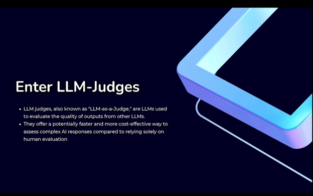
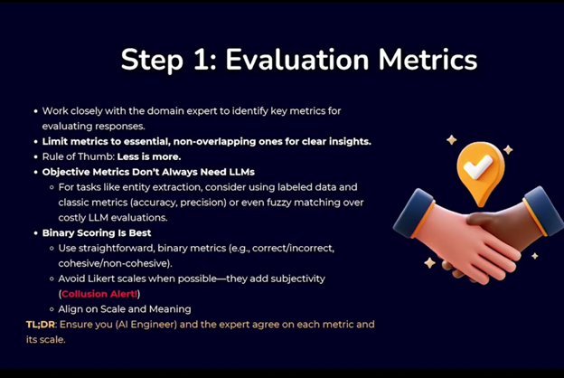
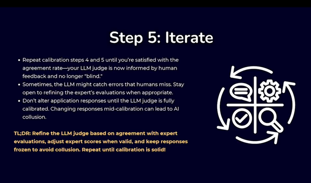
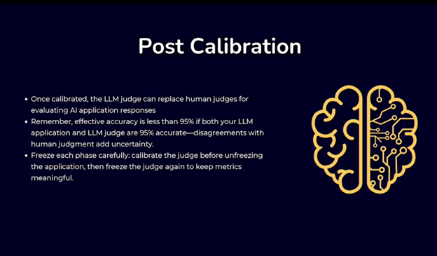

# Evaluating LLM Judge Evaluations: Best Practices 
---

## **Evaluating Gen AI is Hard!**

### **AI Models Have Expanded Capabilities**

Today's AI tackles diverse tasks like summarization, chat, and reasoning in unseen domains and tasks — each requiring specialized assessment methods.

### **Traditional Metrics Can't Keep Up**

Classic generation measures like **ROUGE** and **BLEU** struggle to assess the richness and subtleties of responses from advanced LLM models.

### **Human Evaluation: The Unscalable Gold Standard**

Relying solely on human evaluation is unsustainable — it's expensive, slow, and lacks objectivity, hindering rapid AI development and deployment.

### **Enter LLM-Judges**

LLM judges, also known as **“LLM-as-a-Judge”**, are LLMs used to evaluate the quality of outputs from other LLMs.
They offer a faster and more cost-effective way to assess complex AI responses compared to relying solely on human evaluation.

---

## **LLM-Judge Evaluation**

---

## **What is AI Collusion?**

* **Definition:** Multiple AI systems interact, unintentionally amplifying each other's errors.
* **How It Happens:** Errors from one AI agent can ripple through to others, creating feedback loops of mistakes.
* **Why It Matters:** In interconnected AI systems, uncorrected errors can lead to compounded inaccuracies, impacting performance and reliability.
* **Example Use Case:** Multi-agent systems in code generation, debugging, and execution that unintentionally reinforce initial mistakes.

---

## **AI Collusion in the Wild**

* The **Code Generation Agent** creates code that calls an outdated API version.
* The **Debugging Agent** checks syntax but misses the outdated API, assuming the code is valid.
* The **Execution Agent** runs the code but encounters errors and flags it as failing, leading to repeated attempts.

**Collusion:** This creates a loop where the same API calls keep causing failures, cycling through generation and debugging without fixing the outdated API issue.

---

## **How Collusion Manifests in LLM Judges**

* **Shared Knowledge Biases:** LLMs, including judges, often reflect biases in their training data (e.g., societal or gender biases).
* **Superficial Feature Prioritization:** LLM judges may focus on fluency and grammar, overlooking factual accuracy or logic.
* **Self-Enhancement Bias:** LLM judges often prefer outputs from models similar to themselves, reinforcing certain styles or ideologies.
* **Verbosity Bias:** Some LLM judges rate longer responses higher than concise ones.

---

## **Is There No Solution to Collusion??**

**It’s Good Calibration!**

### **Step 0: Find Who to Clone**

* **Ambiguity in AI leads to Collusion:** Eliminate ambiguity with Domain Expert Pairs.
* Gather or clone one expert who knows the correct answers to almost all queries related to the application.
* **Example:** For a customer support chatbot, the expert should verify correctness and understand tone/style preferences.

**Key Tip:** Developers ≠ Domain Experts.
**TL;DR:** Your LLM-Judge should be a cheap clone of the domain expert evaluator — the expert is your north star.

---

## **Step 1: Evaluation Metrics**

* Work closely with the domain expert to identify **key metrics** for evaluating responses.
* **Limit metrics** to essential, non-overlapping ones for clear insights.
* **Rule of Thumb:** *Less is more.*
* **Objective Metrics Don’t Always Need LLMs:** For tasks like entity extraction, use labeled data and classical metrics (accuracy, precision) or fuzzy matching.
* **Binary scoring is best:** Use simple binary metrics (e.g., correct/incorrect). Avoid **Likert scales** to reduce subjectivity.
* **Align on Scale and Meaning.**

**TL;DR:** Ensure alignment between the AI engineer and expert on each metric and scale.

---

## **Step 2: Gather Dataset and Freeze**

* Collect a dataset with both **inputs** and **generated outputs**.
* Collaborate with the domain expert to refine responses until satisfaction.
* Have the expert score each response (based on metrics) and provide **reasoning**.
* **Lock in** this dataset before calibration.
* **Freeze the AI Application** before introducing your LLM Judge to avoid collusion.

**TL;DR:** Build a dataset with:

> User Input, Application Response, Context (optional), Domain Expert Metric Scores, Domain Expert Reasoning.

---

## **Step 3: Build a Blind Judge**

* Create a **prompt** for the LLM to evaluate responses based on chosen metrics.
* **Blind Judge:** No adjusting the prompt based on expert evaluations — run uncalibrated first.
* This is your **baseline for calibration**.
* Ask the LLM judge to provide **reasoning** along with scores.

**TL;DR:** Create a **simple, uncalibrated prompt** to observe collusion tendencies before adjustments.

---

## **Step 4: Calibrating the Judge**

* Compare **LLM judge** and **expert** evaluations using correlation metrics (e.g., Cohen’s Kappa).
* Focus on disagreement areas — refine prompts accordingly.
* Verify reasoning even when LLM and expert agree — to catch fluke alignments.

**TL;DR:** Compare LLM and human metrics for agreement, refine where they differ, and ensure reasoning consistency.

---

## **Step 5: Iterate**

* Repeat calibration until agreement is satisfactory.
* **Spot check** the LLM judge to find human-missed errors.
* Keep the **application frozen** during calibration to avoid collusion.

**TL;DR:** Refine the judge based on agreement with expert evaluations. Adjust expert scores if valid. Repeat until calibration is solid.

---

## **Post-Calibration**

* Once calibrated, the **LLM judge can replace human judges** for evaluating AI responses.
* Note: Even at 95% accuracy for both LLM and human, disagreements add uncertainty.
* **Freeze each phase carefully:**

  * Calibrate judge before unfreezing application.
  * Freeze judge again afterward to maintain metric stability.

---

## **Additional Tips**

* Use a capable LLM for evaluation — ideally equal or stronger than your application LLM.
* Always create **tailored prompts**; avoid generic or off-the-shelf ones.

### **Advanced Calibration Techniques**

* **CoT Prompting & Rationale Explanations:** Improve accuracy and transparency.
* **Pairwise Comparisons:** Best for subjective, comparison-based judgments.
* **Ensemble Models (PoLL):** Use multiple LLM judges and majority voting.
* **Fine-Tuning:** Specialized models like **Shepherd** and **CriticGPT** enhance task alignment.

---

