# MCP Introduction & What it Enables

---

# **From Generative AI to Agentic AI: The Evolution of Intelligent Systems**

## **Generative AI vs. Agentic AI**
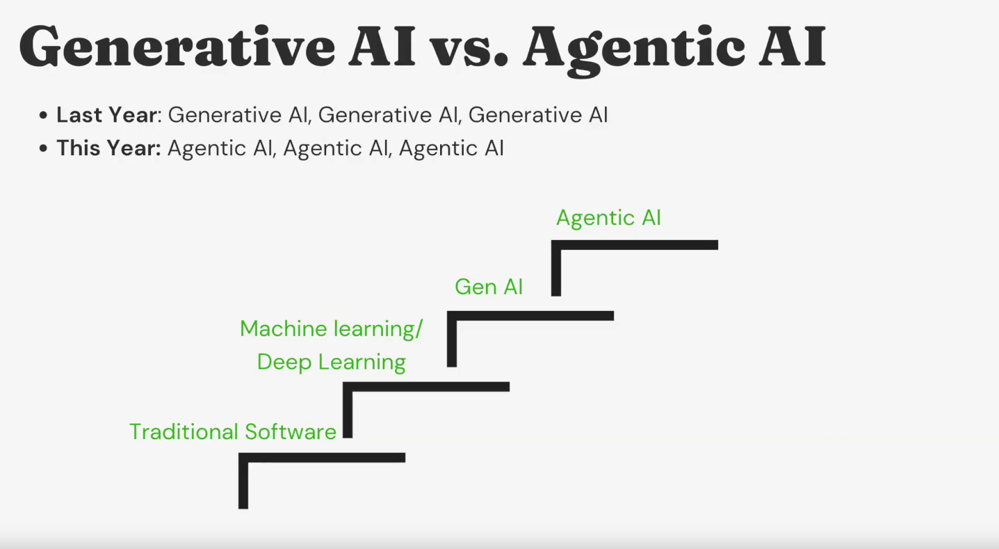

> **Traditional Software → Machine Learning / Deep Learning → Generative AI → Agentic AI**

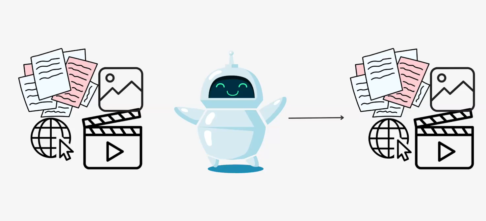
The breakthrough of Generative AI lies in its **zero-shot natural language understanding** — we can now simply **talk** to the AI to perform a task *X* instead of training it specifically.

Modern GenAI systems can understand and generate **text, images, and videos**.

---

## **Limitations of Generative AI and the Need for Agents**
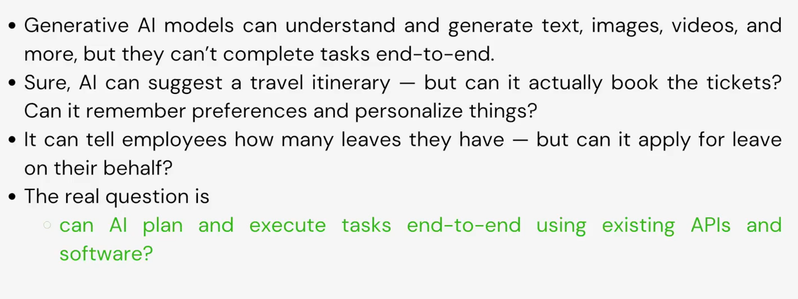
Despite its creativity, **Generative AI cannot perform end-to-end tasks**.
For example, while it can suggest a travel itinerary, it cannot:

* Book tickets
* Remember user preferences
* Personalize results autonomously

Thus, the next challenge is enabling AI to **plan and execute tasks end-to-end**, interacting with existing APIs, tools, and software — this is where **Agentic AI** comes in.

---

## **Agentic AI Components**

Agentic AI extends Generative AI by enabling it to **act** on its own outputs.

Its core components include:

1. **Tool and API Calling:**
   Models can call external tools (e.g., code executors, HTTP requests) to act on the world.
2. **External Memory Access:**
   Retrieve or store relevant information for long-term or contextual reasoning.
3. **Planning:**
   Generate a plan — a structured sequence of actions — before execution.

Its core components include:

1. **Tool and API Calling:**
   Models can call external tools (e.g., code executors, HTTP requests) to act on the world.
2. **External Memory Access:**
   Retrieve or store relevant information for long-term or contextual reasoning.
3. **Planning:**
   Generate a plan — a structured sequence of actions — before execution.

### **Reasoning Models (LRMs)**
### **Reasoning Models (LRMs)**
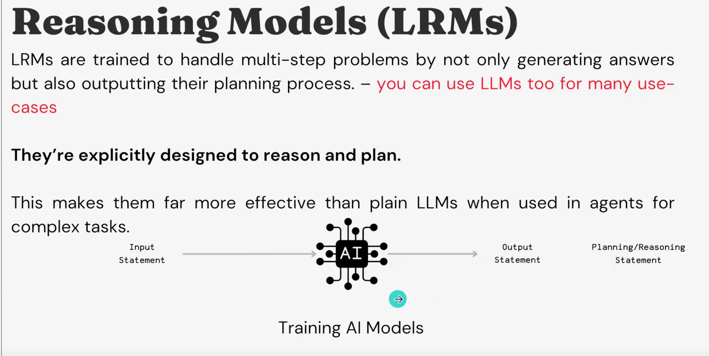
Standard LLMs were built as **chatbots**, not planners, so expecting them to decompose and solve multi-step tasks is unrealistic.
**Reasoning Models (LRMs)** are explicitly trained to handle reasoning and planning, producing both an answer and the thinking steps behind it.

**Examples of LRMs:**

* OpenAI **o1**, **o3**
* **DeepSeek-R1**
* **Gemini Thinking Series**

**Hybrid Models:**
Models like **Claude 3.7** think or reason *only when necessary*, combining efficiency with reasoning depth.

---

## **Tool Calling and the Model Context Protocol (MCP)**

### **Tool Calling**

For AI to **act and reason** effectively, it must interact with the external world through **tools**.
OpenAI introduced **Function (Tool) Calling** in **June 2023**.

**Mechanism:**
**Mechanism:**

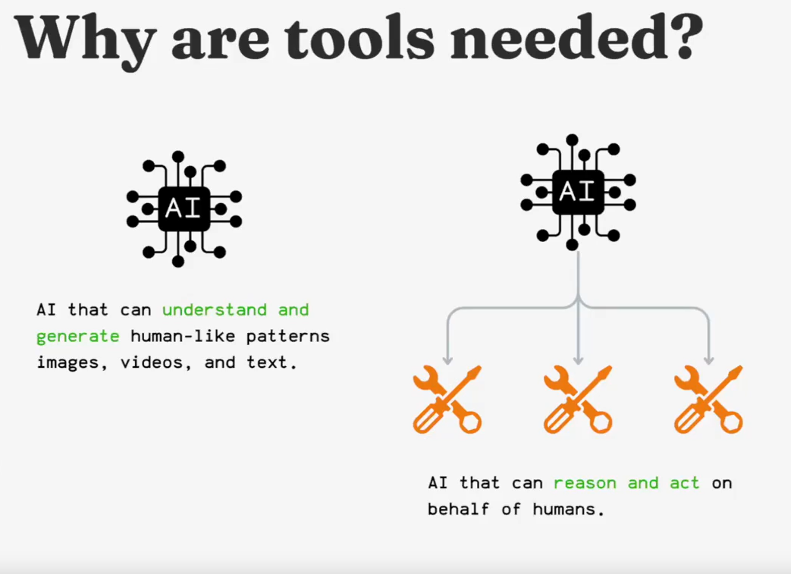

1. The LLM is provided with **tool descriptions** in JSON format.
2. It decides *when* and *which* tool to use, and *what arguments* to pass.
3. The **user or host executes** the tool and returns results.
4. The LLM continues planning and acting until the task completes.

**Example:**
A travel agent AI may call tools to:

* Check flights (read function)
* Book tickets (write function)

---

### **The Tool Specification Problem**
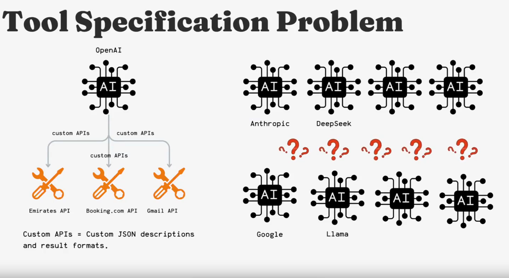
Different LLM providers (e.g., OpenAI, Anthropic, DeepSeek) use **incompatible tool specification formats** —
each with their own JSON schemas, request/response structures, and conventions.

This makes it hard to build one agentic application that works across multiple models and APIs.

---

## **The Model Context Protocol (MCP)**
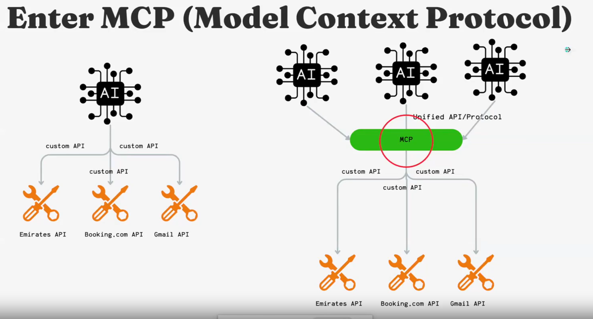
The **Model Context Protocol (MCP)** addresses this issue by proposing a **Unified API/Protocol** for tool usage.

**MCP Standardizes:**

* How tools are described to LLMs
* How requests and responses are formatted
* How richer data types (e.g., audio, video) are handled

### **MCP Architecture**

MCP follows a **Client-Server model**:

* **Server:** Executes tools and APIs
* **Client:** Communicates with the server via the MCP protocol
* **Host:** (e.g., Claude Desktop) integrates and manages communication between model and tools

**Goal:**
Enable **interoperability** — build tools once and use them with **any model, in any environment**.
This promotes developer productivity and faster AI adoption.
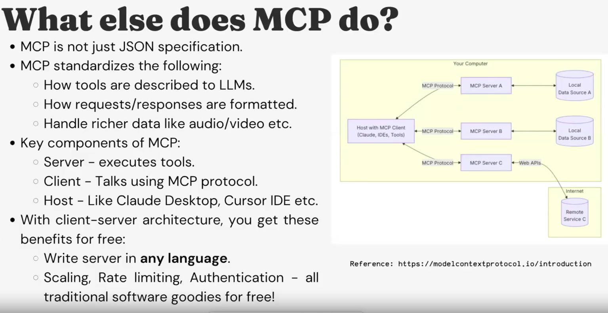

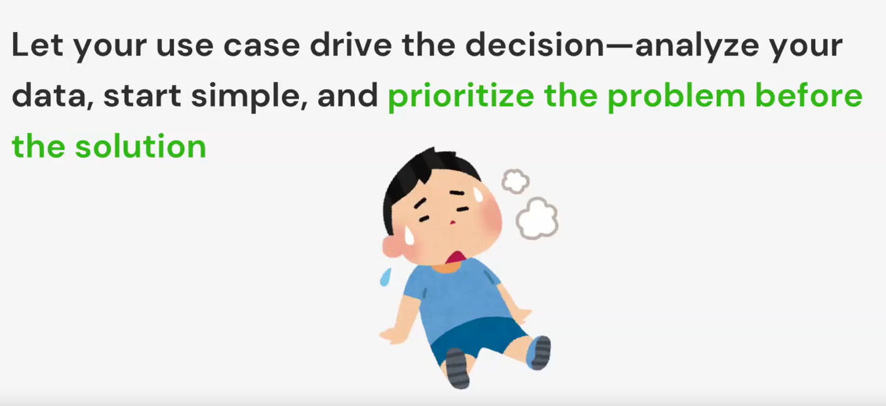
> ⚠️ MCP is still in an **early stage** and not a silver bullet — it’s an evolving standard.

---

## **Designing and Optimizing AI Applications**
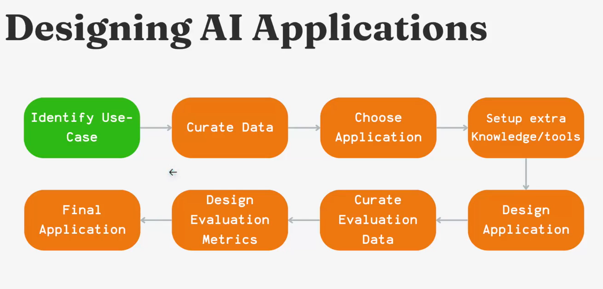
A practical framework for building robust AI systems:

1. **Define the Scope**
   Clearly identify the user problem or workflow.

2. **Curate Data**
   Gather representative and high-quality data for the domain.

3. **Select the Model**
   Balance **Performance**, **Cost**, and **Latency**.
   (Remember: *90% of enterprise use-cases don’t need heavy reasoning models in version 1.*)

4. **Establish Evaluation Metrics**
   Use one or more:

   * Unit tests
   * Regression tests
   * Semantic similarity metrics
   * LLM-based evaluations

5. **Implement Monitoring**
   Continuously evaluate performance, accuracy, and user satisfaction.

---

### **Optimization Techniques**

* **Reduce Hallucination:**
   Improve prompt design, retrieval context, or use Corrective RAG.

* **Enhance Tool Reliability:**
   Clarify tool definitions or employ **multi-agent systems** for coordination.

* **Improve Memory and Retrieval:**
   Use **Hybrid Search** or **Long-Term Memory (episodic/procedural)** for personalization.
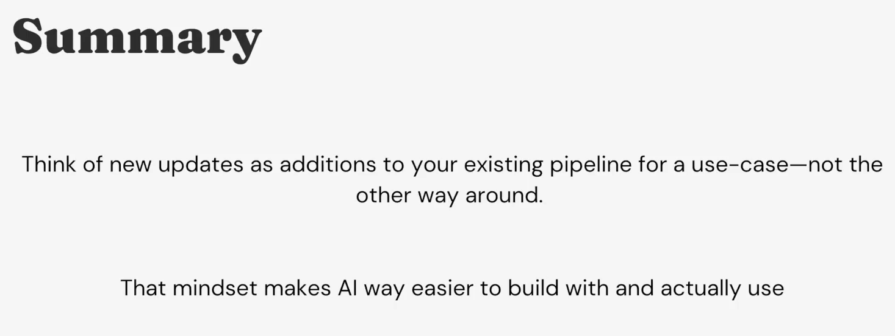
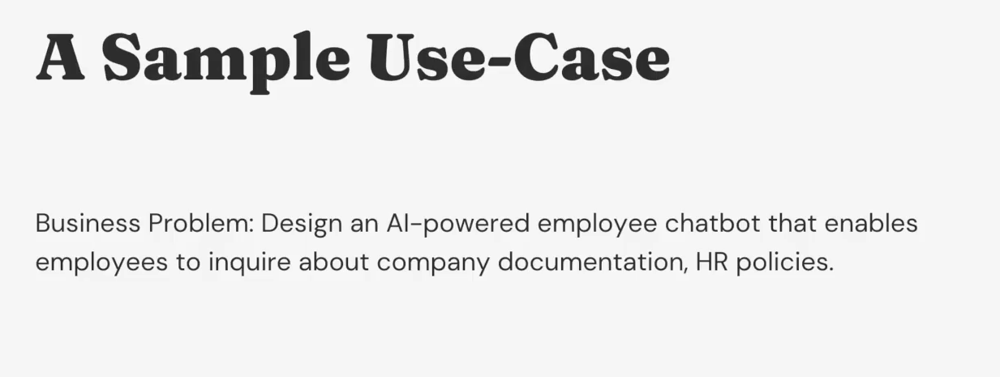

---

## **Key Mindset**

Treat every new advancement (reasoning, memory, or protocol) as an **addition** to your existing AI pipeline — not a replacement.
This modular, layered approach simplifies experimentation, debugging, and scaling of AI systems.

---

